### Thực hiện:
1. **Mở File Explorer:** Nhấn tổ hợp phím Windows + E hoặc nhấp vào biểu tượng thư mục màu vàng trên thanh tác vụ

2. **Truy cập ổ đĩa/thư mục:** Ở cột bên trái, nhấp vào This PC, sau đó nhấp đúp vào một ổ đĩa không phải ổ hệ thống (ví dụ: ổ D: hoặc E:). Nếu chỉ có ổ C:, hãy vào thư mục Documents.

    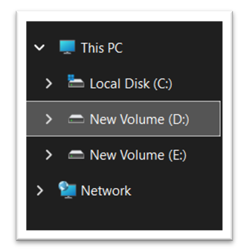

3. **Tạo thư mục mới:** Nhấp chuột phải vào một khoảng trống -> chọn New -> Folder. Đặt tên thư mục là ThucHanh_hotensinhvien (ví dụ: ThucHanh_NguyenVanA). Nhấn Enter.

    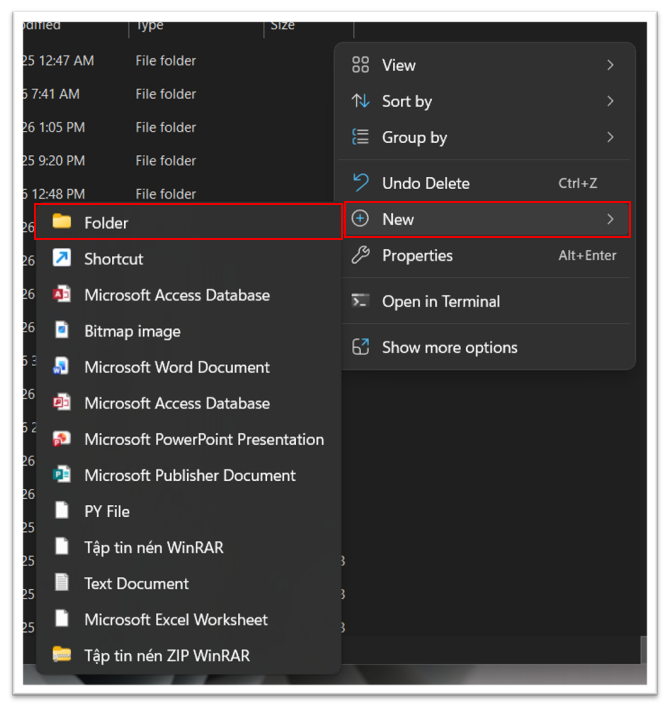
    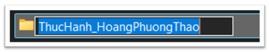

4. **Vào thư mục vừa tạo:** Nhấp đúp vào thư mục ThucHanh_NguyenVanA.

    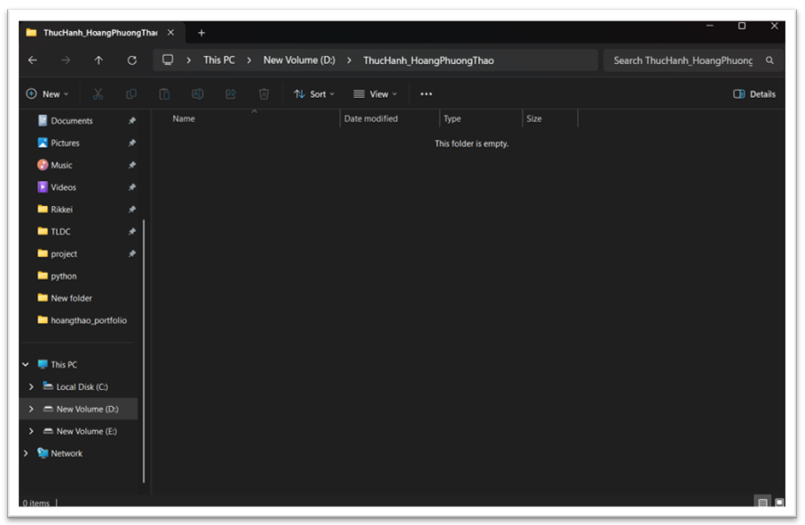

5. **Tạo tệp tin văn bản:** Nhấp chuột phải vào khoảng trống -> New -> Text Document. Đặt tên là GhiChu.txt. Nhấn Enter.

    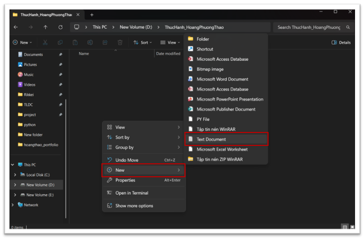
    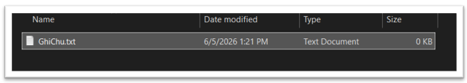

6. **Đổi tên tệp tin:** Nhấp chuột phải vào tệp GhiChu.txt -> chọn Rename. Đổi tên thành GhiChuQuanTrong.txt. Nhấn Enter.

    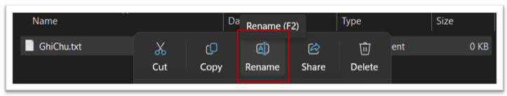
    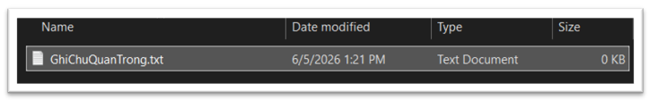

7. **Tạo thư mục con:** Trong thư mục ThucHanh_NguyenVanA, nhấp chuột phải -> New -> Folder. Đặt tên là TaiLieu.

    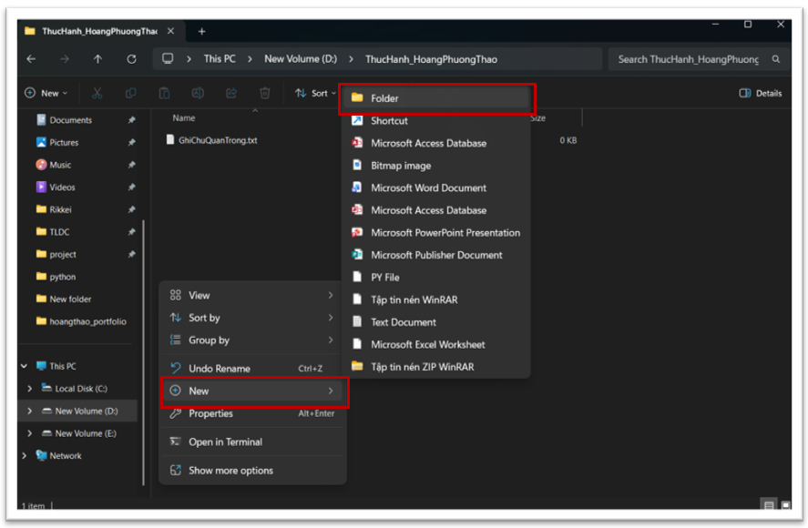
    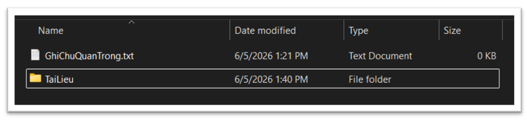

8. **Sao chép tệp tin (Copy & Paste):**
   - Nhấp chuột phải vào tệp GhiChuQuanTrong.txt -> chọn Copy (hoặc chọn tệp rồi nhấn Ctrl + C).
   - Nhấp đúp vào thư mục TaiLieu, nhấp chuột phải vào khoảng trống bên trong -> chọn Paste (hoặc nhấn Ctrl + V). Bây giờ bạn có một bản sao của tệp trong thư mục TaiLieu.

    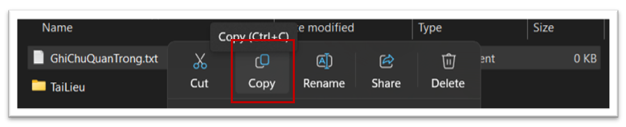
    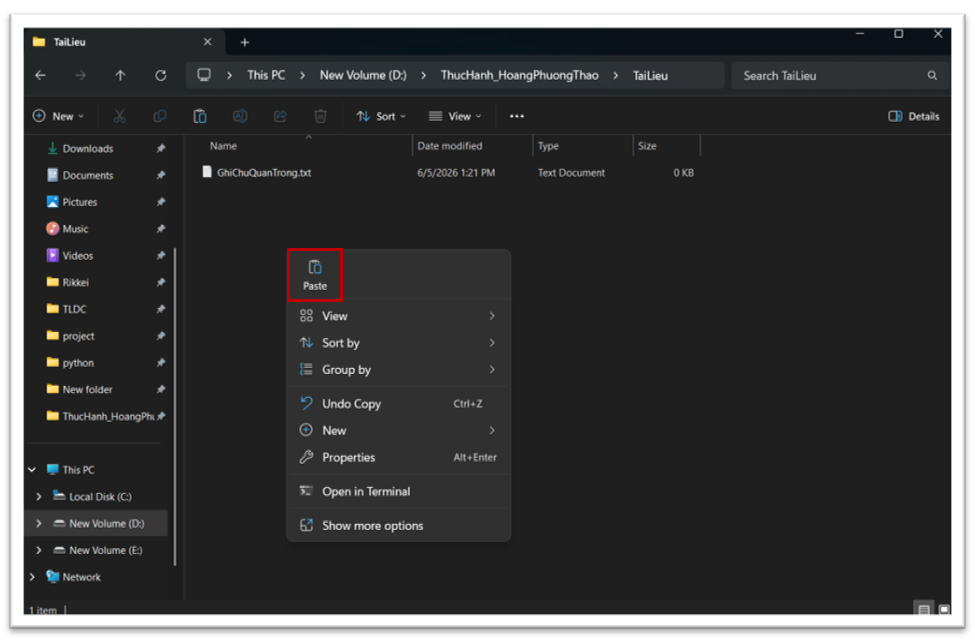

9. **Di chuyển tệp tin (Cut & Paste):**
   - Quay lại thư mục ThucHanh_NguyenVanA. Tạo một tệp với tên là DiChuyen.txt.

    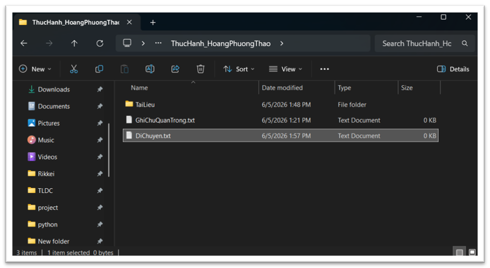

   - Nhấp chuột phải vào tệp DiChuyen.txt -> chọn Cut (hoặc chọn tệp rồi nhấn Ctrl + X).

    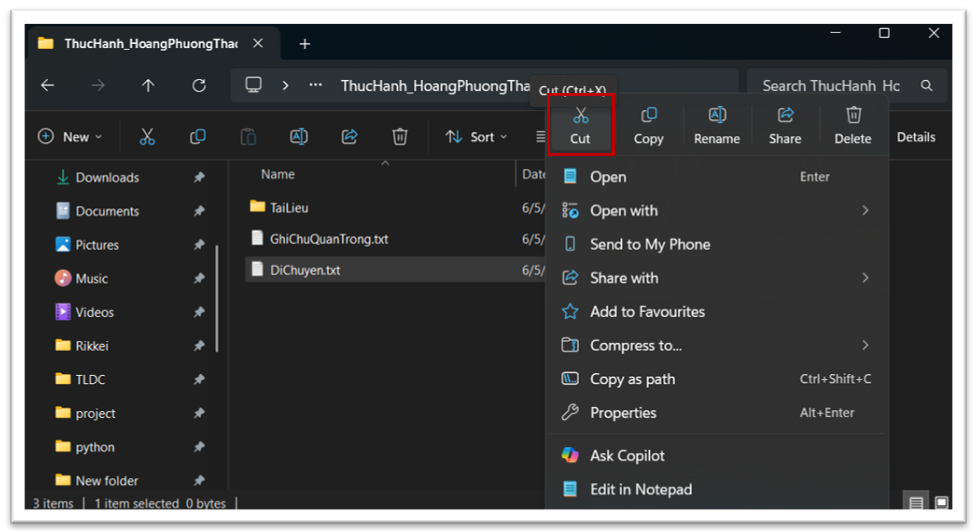

   - Nhấp đúp vào thư mục TaiLieu, nhấp chuột phải vào khoảng trống -> chọn Paste (hoặc nhấn Ctrl + V). Tệp gốc đã biến mất khỏi vị trí cũ và chỉ còn ở vị trí mới.

    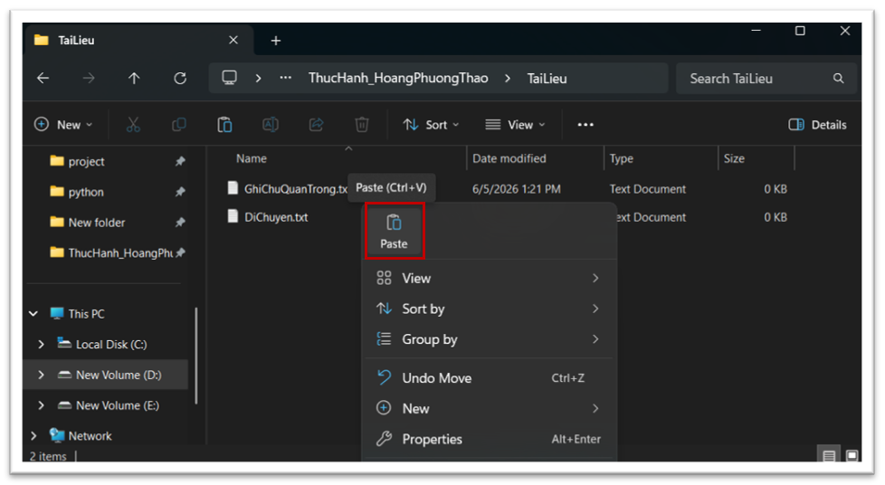

10. **Xóa tệp tin:** Trong thư mục TaiLieu, nhấp chuột phải vào tệp GhiChuQuanTrong.txt -> chọn Delete. Tệp sẽ được chuyển vào Thùng rác (Recycle Bin).

    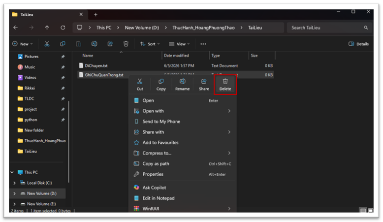

11. **Xóa vĩnh viễn:** Chọn tệp DiChuyen.txt, nhấn giữ phím Shift và nhấn phím Delete. Một cảnh báo sẽ hiện ra. Nếu đồng ý, tệp sẽ bị xóa vĩnh viễn mà không qua Thùng rác.

    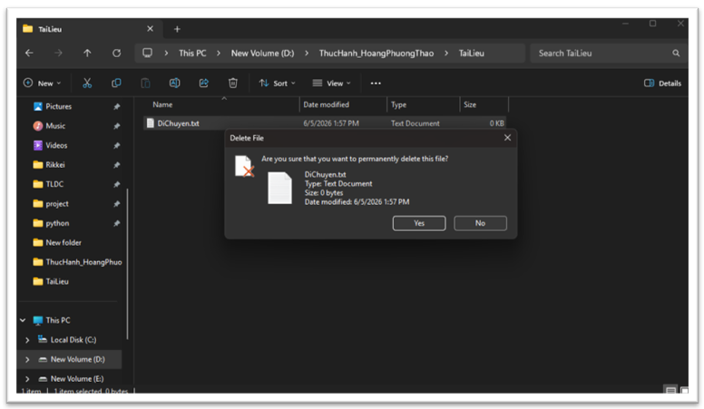

12. **Khôi phục từ Thùng rác (Tùy chọn):** Tìm biểu tượng Recycle Bin trên màn hình nền, nhấp đúp để mở. Tìm tệp GhiChuQuanTrong.txt đã xóa, nhấp chuột phải vào nó và chọn Restore. Tệp sẽ quay trở lại vị trí ban đầu.

    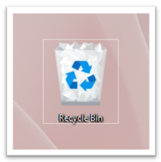
    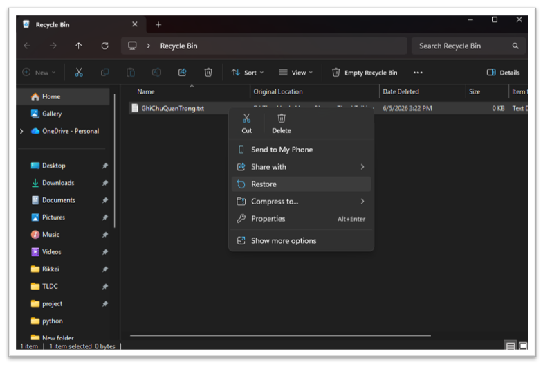

