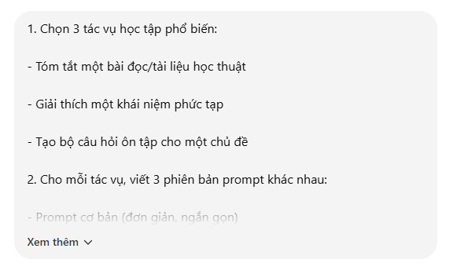
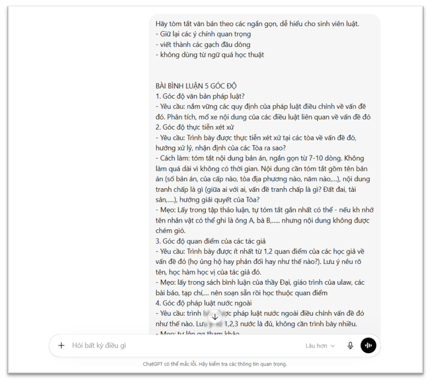
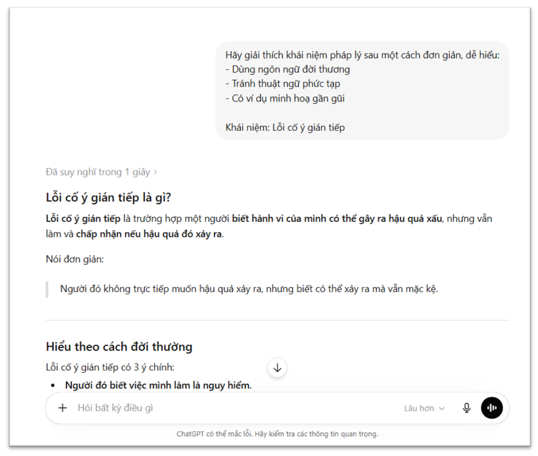
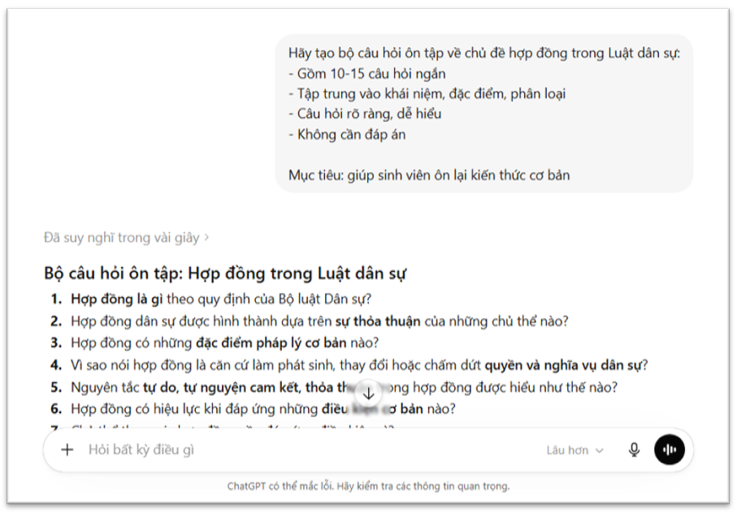
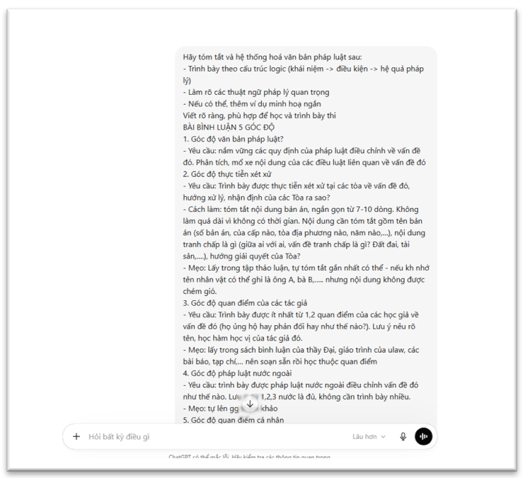
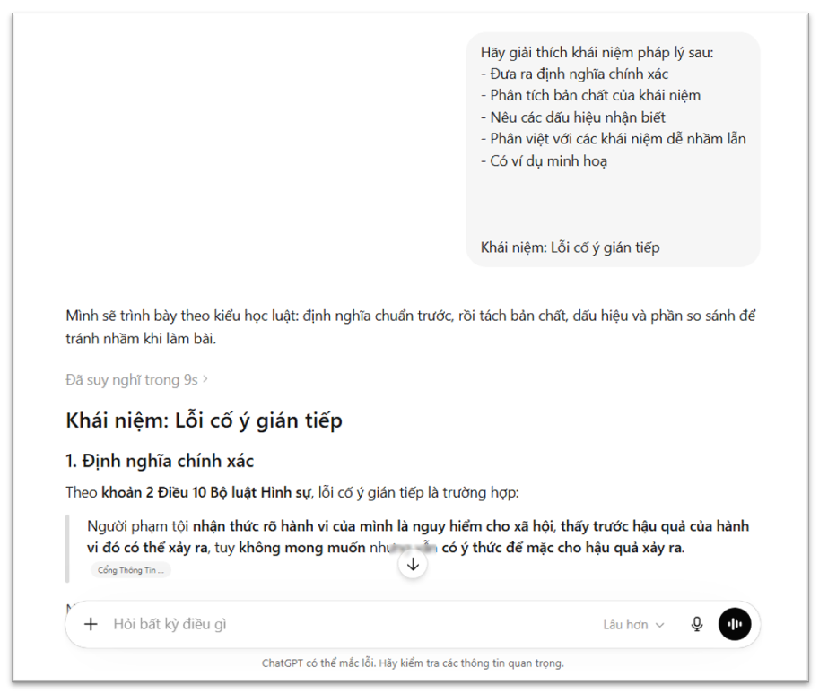
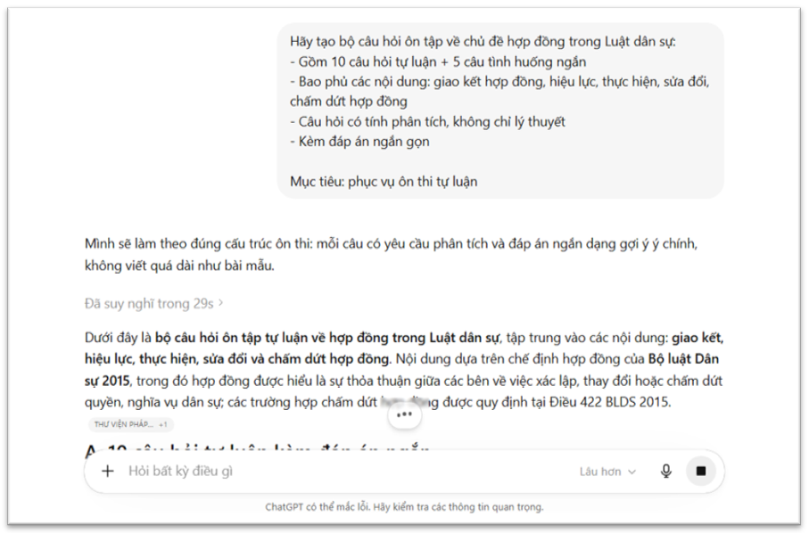
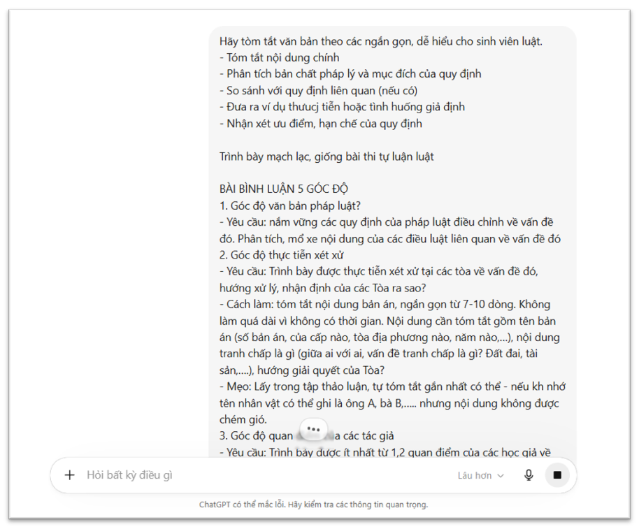
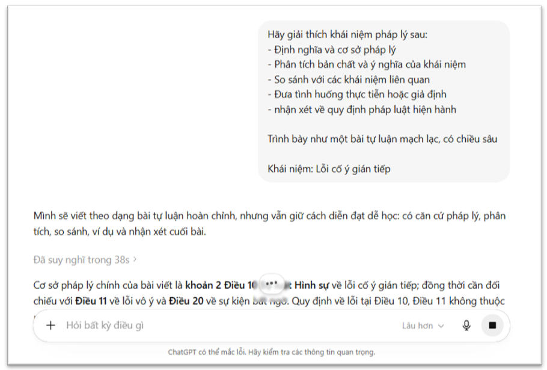
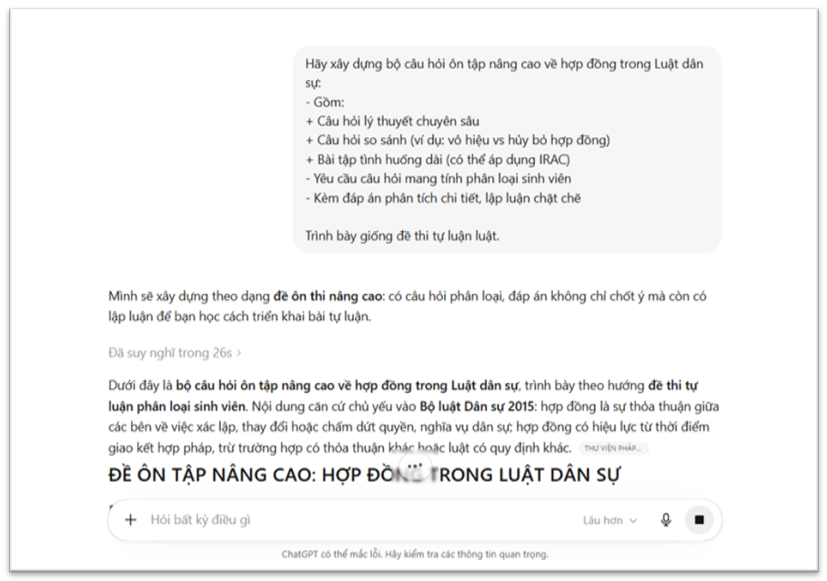

## **Prompt cơ bản**

    
    
    

* Đặc điểm kết quả:

\-Câu hỏi ngắn, thiên về lý thuyết  
\-Chủ yếu dạng: “Trình bày…”, “Nêu khái niệm…”  
\-Ít chiều sâu, ít tình huống

* Đánh giá:

\-Dễ hiểu, nhanh  
\-Không giúp luyện tư duy pháp lý

## **Prompt cải tiến**

    
    
    

* Đặc điểm kết quả:

\-Có cả câu tự luận \+ tình huống

\-Bao quát nhiều nội dung (giao kết, hiệu lực, chấm dứt…)

\-Có đáp án → dễ tự học

* Đánh giá: 

\-Cân bằng giữa lý thuyết và thực hành

\- Bắt đầu có tư duy phân tích

\- Chưa thật sự “đánh đố” như đề thi khó

## **Prompt nâng cao**

    
    
    

* Đặc điểm kết quả:

\-Có câu hỏi so sánh, phân tích sâu

\-Tình huống dài, có thể áp dụng IRAC

\-Đáp án lập luận chặt chẽ

* Đánh giá:

\- Rất sát đề thi thật

\-Phân loại được sinh viên

\- Khó, mất thời gian nếu chưa có nề

**Phân tích lý do sự khác biệt**: Sự khác biệt về chất lượng đầu ra giữa các prompt xuất phát chủ yếu từ mức độ cụ thể và định hướng mà mỗi prompt đưa ra. Prompt cơ bản chỉ nêu yêu cầu chung nên mô hình không có đủ thông tin để xác định rõ mục tiêu, dẫn đến việc tạo ra các câu hỏi mang tính an toàn, thiên về lý thuyết và thiếu chiều sâu. Trong khi đó, prompt cải tiến đã bổ sung các yếu tố như số lượng, loại câu hỏi và phạm vi nội dung, giúp mô hình hiểu rõ hơn yêu cầu và tạo ra kết quả có tính hệ thống hơn. Đối với prompt nâng cao, việc đưa ra các yêu cầu về tư duy như phân tích, áp dụng tình huống và định hướng học thuật đã khiến mô hình tạo ra nội dung có độ khó và chiều sâu cao hơn, phù hợp với mục tiêu luyện thi và phân loại sinh viên.

**Nguyên tắc viết prompt hiệu quả**: Từ kết quả thực nghiệm, có thể rút ra một số nguyên tắc quan trọng khi viết prompt. Trước hết, cần cụ thể hóa yêu cầu thay vì diễn đạt chung chung, bao gồm việc xác định rõ nội dung, số lượng và hình thức đầu ra. Thứ hai, phải xác định mục tiêu sử dụng của prompt như ôn tập, luyện thi hay kiểm tra kiến thức, từ đó điều chỉnh cách đặt yêu cầu cho phù hợp. Thứ ba, nên quy định rõ mức độ tư duy mong muốn như nhận biết, phân tích hay vận dụng để định hướng chất lượng nội dung. Ngoài ra, việc cung cấp bối cảnh như chương học hoặc văn bản pháp luật liên quan cũng giúp kết quả sát với nhu cầu thực tế hơn.

**Mẹo viết prompt hiệu quả**: Bên cạnh các nguyên tắc trên, có thể áp dụng một số mẹo thực tiễn để nâng cao hiệu quả của prompt. Cụ thể, nên viết prompt theo dạng giống đề bài trong thực tế để mô hình dễ hiểu yêu cầu, sử dụng câu chữ rõ ràng và không ngại trình bày chi tiết. Đồng thời, luôn yêu cầu cách trình bày mạch lạc, logic để đảm bảo chất lượng đầu ra. Nếu muốn nội dung có chiều sâu hơn, có thể bổ sung các cụm từ như “theo hướng học thuật”, “có tính phân loại sinh viên” hoặc “áp dụng vào tình huống thực tiễn” để định hướng rõ ràng hơn cho mô hình.

**Kết luận**: Tóm lại, hiệu quả của một prompt phụ thuộc trực tiếp vào mức độ cụ thể và định hướng mà người viết đưa ra. Prompt càng rõ ràng, chi tiết và có mục tiêu cụ thể thì kết quả đầu ra càng có chất lượng cao, phù hợp với yêu cầu học tập và thi cử. Ngược lại, prompt chung chung sẽ chỉ tạo ra nội dung ở mức cơ bản và ít giá trị ứng dụng.