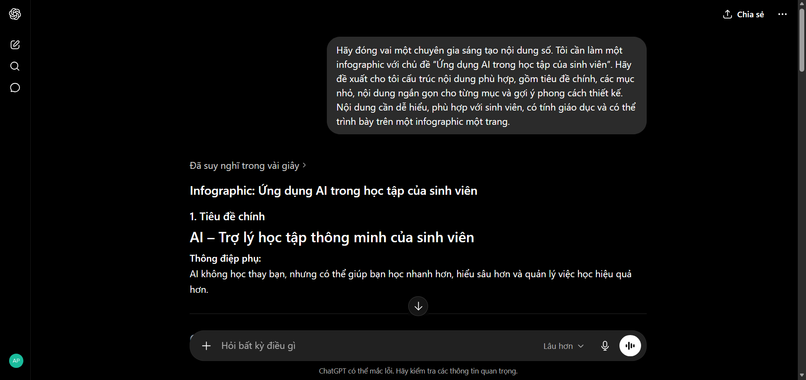
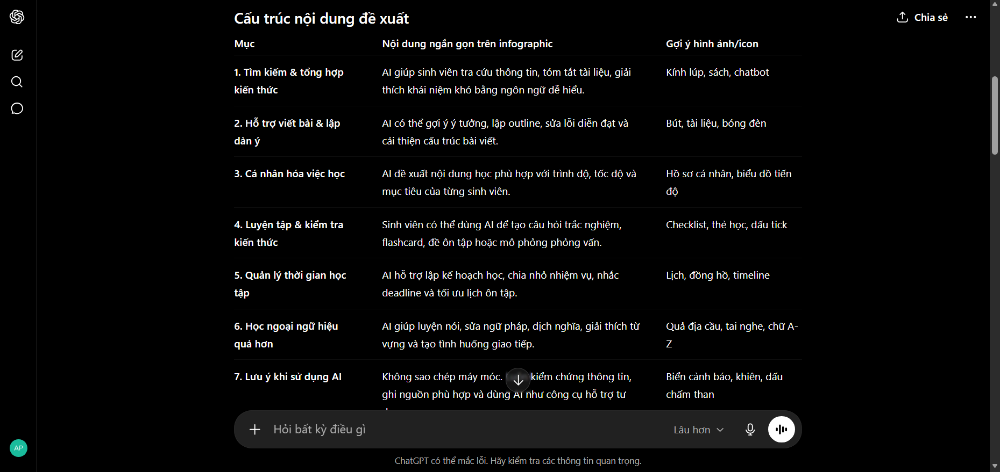
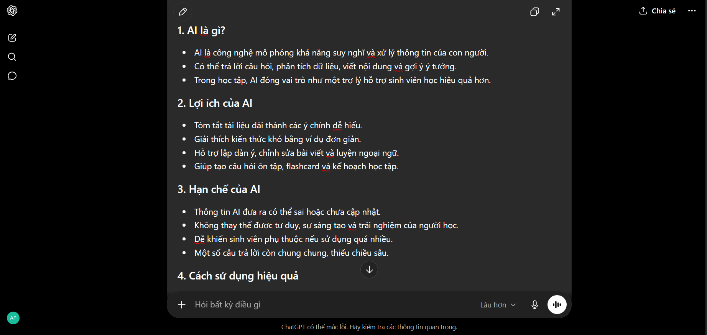
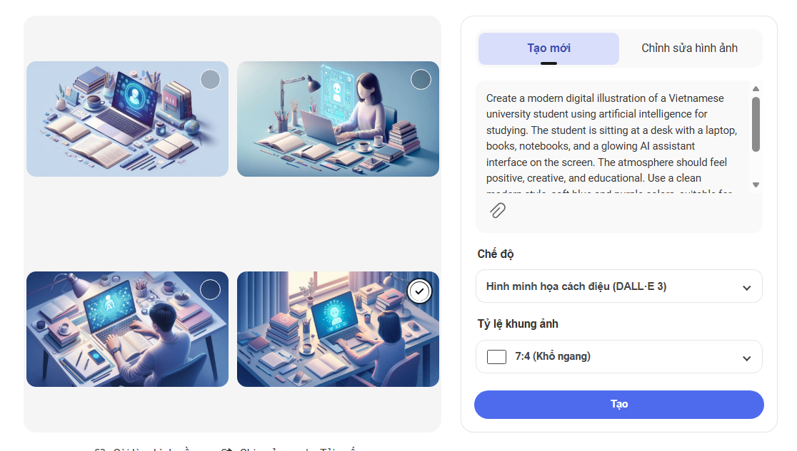
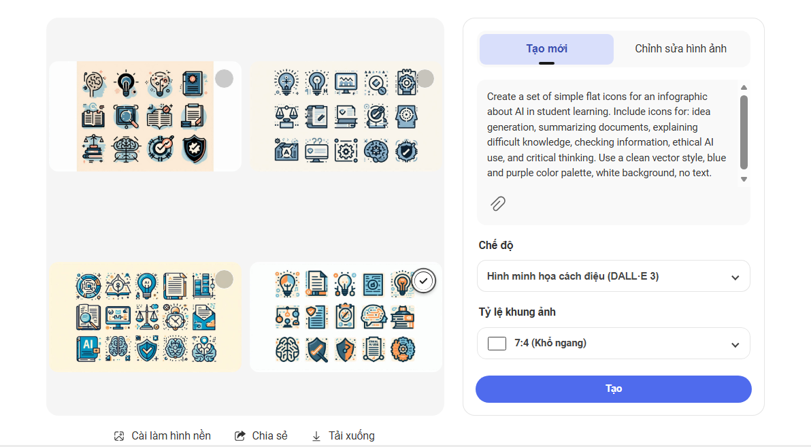
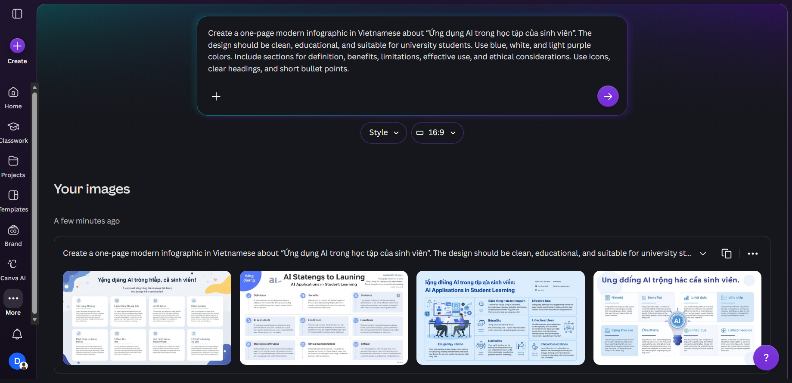
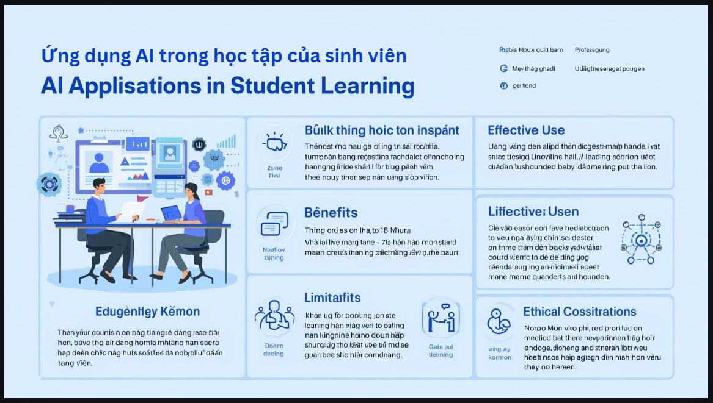

# BÁO CÁO DỰ ÁN SÁNG TẠO NỘI DUNG SỐ BẰNG CÔNG CỤ AI TẠO SINH

## Thông tin sinh viên

- **Họ và tên:** Hoàng Phương Thảo
- **Mã sinh viên:** 24061610
- **Lớp:** VNU1001\_E252034
- **Môn học:** Nhập môn công nghệ số và ứng dụng trí tuệ nhân tạo
- **Tên bài tập:** Sử dụng công cụ AI tạo sinh trong sáng tạo nội dung số  

# I. Giới thiệu dự án

Trong bài tập này, em lựa chọn thực hiện một sản phẩm sáng tạo nội dung số dưới dạng **infographic** với chủ đề: “Ứng dụng AI trong học tập của sinh viên”

# II. Các công cụ AI đã sử dụng

Trong dự án này, em sử dụng ba nhóm công cụ AI tạo sinh theo đúng yêu cầu của đề bài.

| STT | Công cụ AI | Nhóm công cụ | Vai trò trong dự án |
|---|---|---|---|
| 1 | ChatGPT | AI tạo văn bản | Hỗ trợ lên ý tưởng, đề xuất bố cục, viết nội dung nháp cho infographic và hỗ trợ viết báo cáo |
| 2 | Nano Banana AI | AI tạo hình ảnh | Tạo hình ảnh minh họa liên quan đến sinh viên, học tập và công nghệ AI |
| 3 | Bing Image Creator / DALL-E | AI hỗ trợ thiết kế | Gợi ý mẫu thiết kế, bố cục, biểu tượng, màu sắc và hỗ trợ hoàn thiện infographic |

Việc kết hợp ba công cụ này giúp quá trình sáng tạo được chia thành nhiều giai đoạn rõ ràng. ChatGPT đảm nhiệm phần nội dung, công cụ tạo ảnh đảm nhiệm phần hình ảnh minh họa, còn Bing Image Creator / DALL-E hỗ trợ phần trình bày và thiết kế trực quan.

# III. Mô tả sản phẩm cuối cùng

Sản phẩm cuối cùng là một infographic có chủ đề:

## “Ứng dụng AI trong học tập của sinh viên”

Infographic được thiết kế theo phong cách hiện đại, sử dụng màu sắc chủ đạo là xanh dương, trắng và tím nhạt để tạo cảm giác công nghệ, trẻ trung và dễ nhìn. Nội dung infographic được chia thành 5 phần chính:

1. **AI là gì?**  
   Giới thiệu ngắn gọn về trí tuệ nhân tạo và vai trò của AI trong học tập.

2. **Lợi ích của AI trong học tập**  
   Trình bày các lợi ích như hỗ trợ tìm kiếm thông tin, giải thích kiến thức khó, gợi ý ý tưởng, tóm tắt tài liệu và hỗ trợ luyện tập.

3. **Hạn chế khi sử dụng AI**  
   Nêu các vấn đề như thông tin có thể sai, nội dung đôi khi chung chung, dễ gây phụ thuộc và thiếu tư duy phản biện nếu sử dụng không đúng cách.

4. **Cách sử dụng AI hiệu quả**  
   Đưa ra các lời khuyên như viết prompt rõ ràng, kiểm tra lại thông tin, chỉnh sửa kết quả AI và kết hợp với kiến thức cá nhân.

5. **Lưu ý đạo đức**  
   Nhấn mạnh việc không sao chép nguyên văn, không gian lận học tập, cần ghi nhận vai trò của AI và sử dụng AI như một công cụ hỗ trợ thay vì thay thế hoàn toàn con người.

Sản phẩm hướng đến đối tượng người xem là sinh viên, đặc biệt là những người đang bắt đầu sử dụng AI trong học tập. Vì vậy, nội dung được trình bày ngắn gọn, dễ hiểu, có hình ảnh minh họa và biểu tượng trực quan.

# IV. Quá trình sử dụng AI trong sáng tạo sản phẩm

## 1. Sử dụng ChatGPT để lên ý tưởng và xây dựng nội dung

Ở giai đoạn đầu, em sử dụng ChatGPT để tìm ý tưởng tổng thể cho infographic. Mục tiêu là có được một cấu trúc nội dung rõ ràng, phù hợp với chủ đề và dễ triển khai thành thiết kế trực quan.

### Prompt 1: Yêu cầu ChatGPT đề xuất ý tưởng infographic

**Prompt đã sử dụng:**

> Hãy đóng vai một chuyên gia sáng tạo nội dung số. Tôi cần làm một infographic với chủ đề “Ứng dụng AI trong học tập của sinh viên”. Hãy đề xuất cho tôi cấu trúc nội dung phù hợp, gồm tiêu đề chính, các mục nhỏ, nội dung ngắn gọn cho từng mục và gợi ý phong cách thiết kế. Nội dung cần dễ hiểu, phù hợp với sinh viên, có tính giáo dục và có thể trình bày trên một infographic một trang.

**Kết quả nhận được:**

ChatGPT đề xuất infographic gồm các phần chính: Tìm kiếm & tổng hợp kiến thức, Hỗ trợ viết bài & lập dàn ý, Cá nhân hóa việc học, Luyện tập & kiểm tra kiến thức, Quản lý thời gian học tập, Học ngoại ngữ hiệu quả hơn, Lưu ý khi sử dụng AI. Ngoài ra, ChatGPT cũng gợi ý sử dụng phong cách thiết kế hiện đại, trẻ trung, bố cục một trang, dễ đọc, không quá nhiều chữ, uu tiên biểu tượng minh họa thay vì đoạn văn dài. Nền sáng: trắng, xanh nhạt hoặc tím nhạt. Màu chủ đạo: xanh dương, tím, xanh mint. Màu nhấn: vàng hoặc cam cho các ý quan trọng.

**Cách chỉnh sửa và tích hợp:**

Sau khi nhận được kết quả, em không sử dụng nguyên văn toàn bộ nội dung mà chọn lọc lại các ý phù hợp nhất. Một số phần do ChatGPT viết còn dài, vì vậy em rút gọn thành các câu ngắn để phù hợp với infographic. Ví dụ, phần “AI giúp sinh viên tiếp cận tri thức nhanh hơn thông qua khả năng tổng hợp và giải thích thông tin” được em chỉnh thành “AI giúp tìm thông tin, tóm tắt tài liệu và giải thích kiến thức nhanh hơn”.

*Ảnh chụp màn hình prompt và kết quả ChatGPT đề xuất ý tưởng infographic*

### Prompt 2: Yêu cầu ChatGPT viết nội dung ngắn gọn cho infographic

**Prompt đã sử dụng:**

> Hãy viết nội dung ngắn gọn cho một infographic chủ đề “Ứng dụng AI trong học tập của sinh viên”. Nội dung gồm 5 phần: AI là gì, lợi ích, hạn chế, cách sử dụng hiệu quả và lưu ý đạo đức. Mỗi phần chỉ viết 3-5 ý ngắn, dễ đọc, phù hợp để đưa vào thiết kế infographic. Ngôn ngữ cần tự nhiên, dễ hiểu, không quá học thuật.

**Kết quả nhận được:**

ChatGPT tạo ra nội dung dạng gạch đầu dòng cho từng phần. Nội dung bao gồm các ý như: AI là gì?, lợi ích của AI, hạn chế của AI, cách sử dụng hiệu quả, lưu ý đạo đức; hạn chế là có thể đưa ra thông tin chưa chính xác, dễ khiến người học phụ thuộc; lời khuyên là cần kiểm chứng thông tin, đặt câu hỏi rõ ràng và tự chỉnh sửa lại kết quả.

**Cách chỉnh sửa và tích hợp:**

Em tiếp tục chỉnh sửa nội dung để phù hợp với bố cục thực tế của infographic. Một số câu được rút ngắn để tránh quá nhiều chữ. Em cũng thêm một số ý cá nhân, chẳng hạn như “AI không thay thế việc tự học” và “Sinh viên cần dùng AI như một trợ lý học tập”. Đây là những ý do em tự bổ sung để sản phẩm có quan điểm rõ ràng hơn.

Ảnh chụp màn hình ChatGPT tạo nội dung chi tiết cho infographic

## 2. Sử dụng AI tạo hình ảnh để tạo minh họa

Sau khi có nội dung chính, em sử dụng công cụ AI tạo hình ảnh để tạo hình minh họa cho infographic. Mục tiêu là tạo ra hình ảnh thể hiện sự kết hợp giữa sinh viên, học tập và công nghệ AI.

Công cụ được sử dụng là **Nano Banana AI**.

### Prompt 3: Tạo hình minh họa chính cho infographic

**Prompt đã sử dụng:**

> Create a modern digital illustration of a Vietnamese university student using artificial intelligence for studying. The student is sitting at a desk with a laptop, books, notebooks, and a glowing AI assistant interface on the screen. The atmosphere should feel positive, creative, and educational. Use a clean modern style, soft blue and purple colors, suitable for an infographic about AI in education. No text in the image.

**Kết quả nhận được:**

Công cụ tạo ảnh đã tạo ra một số hình ảnh minh họa sinh viên đang học với máy tính, xung quanh có các biểu tượng công nghệ, sách vở và ánh sáng thể hiện yếu tố AI. Một số ảnh có bố cục khá đẹp, màu sắc phù hợp với phong cách hiện đại và có thể dùng làm hình minh họa chính cho infographic.

**Cách chỉnh sửa và tích hợp:**

Trong các kết quả được tạo ra, em chọn hình ảnh có bố cục rõ ràng nhất và không chứa chữ bị lỗi. Sau đó, em đưa hình ảnh vào Canva để cắt bớt phần thừa, điều chỉnh kích thước và đặt ở phần đầu infographic. Em cũng giảm độ nổi bật của hình ảnh để không làm rối bố cục tổng thể.

Ảnh chụp màn hình prompt tạo ảnh và kết quả hình ảnh AI tạo ra

### Prompt 4: Tạo biểu tượng minh họa cho các mục nội dung

**Prompt đã sử dụng:**

> Create a set of simple flat icons for an infographic about AI in student learning. Include icons for: idea generation, summarizing documents, explaining difficult knowledge, checking information, ethical AI use, and critical thinking. Use a clean vector style, blue and purple color palette, white background, no text.

**Kết quả nhận được:**

AI tạo ra một số hình ảnh dạng biểu tượng liên quan đến bóng đèn ý tưởng, tài liệu, não bộ, máy tính, dấu kiểm và biểu tượng đạo đức. Các biểu tượng có phong cách đơn giản, phù hợp để chia nhỏ nội dung infographic.

**Cách chỉnh sửa và tích hợp:**

Em không dùng toàn bộ biểu tượng AI tạo ra mà chỉ chọn những biểu tượng dễ hiểu, rõ nét và phù hợp với từng mục. Một số biểu tượng chưa chính xác hoặc bị thừa chi tiết nên em thay thế bằng icon có sẵn trong Canva. Điều này giúp infographic có sự thống nhất hơn về phong cách hình ảnh.

Ảnh chụp màn hình quá trình tạo icon minh họa bằng AI

## 3. Sử dụng Canva AI để thiết kế infographic

Sau khi có nội dung và hình ảnh minh họa, em sử dụng Bing Image Creator / DALL-E để thiết kế sản phẩm cuối cùng. Bing Image Creator / DALL-E hỗ trợ gợi ý mẫu thiết kế, bố cục, font chữ, màu sắc và các thành phần trang trí.

### Prompt 5: Yêu cầu Canva AI gợi ý thiết kế infographic

**Prompt đã sử dụng trong Bing Image Creator / DALL-E:**

> Create a one-page modern infographic in Vietnamese about “Ứng dụng AI trong học tập của sinh viên”. The design should be clean, educational, and suitable for university students. Use blue, white, and light purple colors. Include sections for definition, benefits, limitations, effective use, and ethical considerations. Use icons, clear headings, and short bullet points.

**Kết quả nhận được:**

Canva AI gợi ý một số mẫu infographic có bố cục dọc, chia nội dung thành nhiều khối rõ ràng. Các mẫu sử dụng màu xanh dương, tím nhạt và trắng, phù hợp với chủ đề công nghệ. Một số mẫu có sẵn icon, khung nội dung và phần tiêu đề nổi bật.

**Cách chỉnh sửa và tích hợp:**

Em chọn một mẫu có bố cục rõ ràng nhất, sau đó thay đổi lại nội dung theo phần đã chỉnh sửa từ ChatGPT. Em cũng thay một số icon, điều chỉnh khoảng cách giữa các khối nội dung, thay đổi kích thước chữ để dễ đọc hơn. Ngoài ra, em thêm hình ảnh minh họa được tạo từ AI vào phần đầu của infographic để tăng tính trực quan.

Ảnh chụp màn hình quá trình thiết kế trên Canva AI

### Các chỉnh sửa cá nhân trong Canva

Sau khi Canva AI tạo bố cục ban đầu, em thực hiện các chỉnh sửa cá nhân sau:

- Rút gọn nội dung để mỗi mục không quá dài.
- Sắp xếp lại thứ tự các phần để người xem dễ theo dõi.
- Chọn lại font chữ rõ ràng, dễ đọc.
- Điều chỉnh màu sắc chủ đạo thành xanh dương, trắng và tím nhạt.
- Thay một số biểu tượng chưa phù hợp.
- Căn chỉnh khoảng cách giữa các khối nội dung.
- Thêm phần kết luận ngắn ở cuối infographic: “AI là công cụ hỗ trợ, không thay thế tư duy của sinh viên.”
- Kiểm tra lỗi chính tả và sửa lại các câu chưa tự nhiên.

Nhờ quá trình chỉnh sửa này, sản phẩm cuối cùng không còn là kết quả tự động hoàn toàn từ AI mà đã có sự đóng góp cá nhân rõ ràng trong nội dung, bố cục và cách truyền tải thông điệp.

**Vị trí chèn ảnh minh họa:**

Ảnh chụp màn hình sản phẩm infographic hoàn chỉnh

# V. Các phiên bản trung gian của dự án

Trong quá trình thực hiện, sản phẩm đã trải qua một số phiên bản trung gian trước khi hoàn thiện.

## Phiên bản 1: Bản ý tưởng nội dung

Ở phiên bản đầu tiên, em chỉ mới có nội dung dạng gạch đầu dòng do ChatGPT hỗ trợ tạo ra. Nội dung lúc này còn khá dài và mang tính liệt kê. Một số ý chưa phù hợp để đưa trực tiếp vào infographic vì quá nhiều chữ.

## Phiên bản 2: Bản nội dung đã rút gọn

Sau khi đọc lại nội dung, em rút gọn các câu dài, bỏ bớt những ý trùng lặp và sắp xếp thành 5 nhóm nội dung chính. Phiên bản này phù hợp hơn để đưa vào thiết kế vì mỗi phần chỉ còn các ý ngắn, dễ đọc.

## Phiên bản 3: Bản thiết kế nháp trên Canva

Ở phiên bản này, em đưa nội dung vào mẫu infographic trên Canva. Tuy nhiên, bố cục ban đầu còn chưa cân đối, một số phần có quá nhiều chữ, hình ảnh minh họa chưa hài hòa với màu sắc chung.

## Phiên bản 4: Bản hoàn chỉnh

Ở phiên bản cuối cùng, em chỉnh lại bố cục, giảm bớt chữ, thay icon phù hợp, căn chỉnh khoảng cách, bổ sung hình minh họa chính và kiểm tra lại toàn bộ nội dung. Đây là phiên bản được sử dụng làm sản phẩm cuối cùng để nộp kèm báo cáo.

# VI. So sánh và phân tích hiệu quả của các công cụ AI đã sử dụng

Trong quá trình thực hiện dự án, mỗi công cụ AI có vai trò, điểm mạnh và hạn chế riêng. Việc so sánh các công cụ giúp em hiểu rõ hơn cách sử dụng AI hiệu quả trong từng giai đoạn sáng tạo.

| Công cụ | Điểm mạnh | Hạn chế | Mức độ hữu ích trong dự án |
|---|---|---|---|
| ChatGPT | Tạo ý tưởng nhanh, viết nội dung mạch lạc, gợi ý bố cục tốt | Nội dung đôi khi chung chung, cần kiểm tra và chỉnh sửa lại | Rất hữu ích ở giai đoạn lên ý tưởng và viết nội dung |
| Bing Image Creator/DALL-E | Tạo hình ảnh minh họa nhanh, phong cách đa dạng, phù hợp với chủ đề sáng tạo | Một số ảnh có chi tiết chưa chính xác hoặc không đúng hoàn toàn yêu cầu | Hữu ích trong việc tạo hình ảnh minh họa |
| Bing Image Creator / DALL-E | Hỗ trợ thiết kế nhanh, nhiều mẫu đẹp, dễ chỉnh sửa | Bố cục AI gợi ý đôi khi chưa phù hợp hoàn toàn với nội dung cụ thể | Rất hữu ích ở giai đoạn trình bày sản phẩm |

ChatGPT là công cụ hỗ trợ hiệu quả nhất trong giai đoạn đầu của dự án. Công cụ này giúp em nhanh chóng xác định được cấu trúc nội dung, các ý chính và cách trình bày thông tin. Tuy nhiên, nội dung do ChatGPT tạo ra ban đầu vẫn cần chỉnh sửa vì một số câu còn dài hoặc mang tính khái quát. Nếu đưa nguyên văn vào infographic, sản phẩm sẽ bị nhiều chữ và khó đọc.

Công cụ tạo hình ảnh như Bing Image Creator hoặc DALL-E có ưu điểm là tạo hình minh họa nhanh, có thể tùy chỉnh phong cách thông qua prompt. Khi sử dụng prompt càng chi tiết, hình ảnh tạo ra càng gần với mong muốn. Tuy nhiên, hạn chế là hình ảnh đôi khi có chi tiết chưa hợp lý, ví dụ bố cục hơi rối, nhân vật chưa tự nhiên hoặc xuất hiện chữ không rõ nghĩa. Vì vậy, em chỉ chọn những hình ảnh phù hợp nhất và chỉnh sửa lại trong Canva.

Bing Image Creator / DALL-E hỗ trợ tốt ở phần thiết kế vì có nhiều mẫu, biểu tượng và công cụ chỉnh sửa trực quan. So với việc tự thiết kế từ đầu, Canva giúp tiết kiệm thời gian đáng kể. Tuy nhiên, mẫu thiết kế do Canva gợi ý vẫn cần thay đổi để phù hợp với nội dung thực tế. Em phải tự điều chỉnh màu sắc, font chữ, khoảng cách, thứ tự nội dung và vị trí hình ảnh.

Qua quá trình so sánh, em nhận thấy không có công cụ AI nào có thể tự tạo ra sản phẩm hoàn chỉnh một cách hoàn hảo. Mỗi công cụ chỉ mạnh ở một giai đoạn nhất định. ChatGPT mạnh về ý tưởng và nội dung, công cụ tạo ảnh mạnh về minh họa, còn Bing Image Creator / DALL-E mạnh về bố cục và thiết kế. Sản phẩm cuối cùng chỉ đạt chất lượng tốt khi người dùng biết kết hợp các công cụ này một cách hợp lý và có sự chỉnh sửa cá nhân.

# VII. Vai trò của AI trong quá trình sáng tạo

AI đóng vai trò quan trọng trong quá trình thực hiện dự án vì giúp em tiết kiệm thời gian, mở rộng ý tưởng và cải thiện chất lượng sản phẩm. Trước đây, khi làm một infographic, em thường phải tự tìm ý tưởng, viết nội dung, tìm hình ảnh minh họa và thiết kế bố cục từ đầu. Quá trình này mất khá nhiều thời gian, đặc biệt là ở bước lên ý tưởng và trình bày thông tin sao cho ngắn gọn. Khi sử dụng AI, em có thể nhanh chóng có được bản nháp ban đầu để phát triển tiếp.

ChatGPT giúp em hình thành cấu trúc nội dung rõ ràng. Thay vì bắt đầu từ một trang trắng, em có thể dựa trên các gợi ý của AI để xác định các mục chính cần đưa vào infographic. AI cũng hỗ trợ viết nội dung ban đầu, giúp em có nhiều lựa chọn về cách diễn đạt. Tuy nhiên, vai trò của em vẫn rất quan trọng vì em phải chọn lọc thông tin, rút gọn câu chữ và điều chỉnh nội dung cho phù hợp với mục tiêu sản phẩm.

AI tạo hình ảnh giúp quá trình minh họa trở nên thuận tiện hơn. Thay vì tìm kiếm hình ảnh có sẵn trên Internet, em có thể tạo hình ảnh theo đúng chủ đề mong muốn. Điều này giúp sản phẩm có tính riêng biệt hơn. Tuy vậy, hình ảnh do AI tạo ra không phải lúc nào cũng chính xác hoàn toàn. Một số chi tiết có thể chưa tự nhiên hoặc chưa phù hợp với phong cách thiết kế, vì vậy người dùng vẫn phải đánh giá và chỉnh sửa.

Bing Image Creator / DALL-E giúp em chuyển nội dung thành sản phẩm trực quan. Công cụ này hỗ trợ bố cục, màu sắc và biểu tượng, giúp infographic trở nên chuyên nghiệp hơn. Nhưng nếu chỉ dùng mẫu AI tạo sẵn mà không chỉnh sửa, sản phẩm có thể thiếu dấu ấn cá nhân. Vì vậy, em đã tự điều chỉnh lại nhiều yếu tố như màu sắc, vị trí nội dung, kích thước chữ và hình ảnh minh họa.

Nhìn chung, AI đã thay đổi quy trình sáng tạo của em theo hướng nhanh hơn và linh hoạt hơn. AI không thay thế hoàn toàn vai trò của con người mà đóng vai trò như một trợ lý hỗ trợ trong từng giai đoạn. Người dùng vẫn là người quyết định thông điệp, kiểm soát chất lượng, chỉnh sửa nội dung và chịu trách nhiệm với sản phẩm cuối cùng. Qua bài tập này, em nhận thấy sử dụng AI hiệu quả không phải là sao chép kết quả AI tạo ra, mà là biết đặt câu hỏi đúng, chọn lọc thông tin và kết hợp với tư duy sáng tạo cá nhân.

# VIII. Những phần AI làm tốt và những phần còn hạn chế

## 1. Những phần AI làm tốt

AI làm tốt ở việc tạo ý tưởng ban đầu. Chỉ cần một prompt rõ ràng, ChatGPT có thể đề xuất nhiều hướng triển khai nội dung khác nhau. Điều này giúp người dùng không bị bí ý tưởng khi bắt đầu dự án.

AI cũng làm tốt ở việc tóm tắt và tổ chức thông tin. Với chủ đề “Ứng dụng AI trong học tập của sinh viên”, ChatGPT có thể chia nội dung thành các nhóm hợp lý như lợi ích, hạn chế, cách sử dụng và vấn đề đạo đức. Đây là nền tảng tốt để phát triển thành infographic.

Đối với hình ảnh, công cụ tạo ảnh AI có thể tạo ra hình minh họa nhanh chóng, phù hợp với mô tả trong prompt. Điều này giúp sản phẩm có hình ảnh riêng thay vì chỉ sử dụng các ảnh có sẵn.

Bing Image Creator / DALL-E làm tốt ở phần gợi ý bố cục và mẫu thiết kế. Công cụ này giúp người dùng không cần có kỹ năng thiết kế chuyên sâu vẫn có thể tạo ra sản phẩm tương đối chuyên nghiệp.

## 2. Những phần AI còn hạn chế

Mặc dù hữu ích, AI vẫn có nhiều hạn chế. Thứ nhất, nội dung do AI tạo ra có thể chưa chính xác hoàn toàn, đặc biệt nếu người dùng không kiểm tra lại thông tin. Thứ hai, câu trả lời của AI đôi khi còn chung chung, thiếu ví dụ cụ thể hoặc chưa phù hợp với yêu cầu thực tế.

Đối với công cụ tạo hình ảnh, AI có thể tạo ra hình ảnh đẹp nhưng đôi khi sai chi tiết. Ví dụ, hình ảnh có thể bị lỗi chữ, bố cục rối hoặc nhân vật thiếu tự nhiên. Vì vậy, không thể sử dụng toàn bộ kết quả AI mà cần chọn lọc kỹ.

Với Bing Image Creator / DALL-E, bố cục được gợi ý nhanh nhưng chưa chắc phù hợp hoàn toàn với nội dung. Nếu người dùng không chỉnh sửa, infographic có thể thiếu cân đối hoặc không thể hiện rõ thông điệp chính.

Do đó, AI chỉ nên được xem là công cụ hỗ trợ. Chất lượng cuối cùng của sản phẩm vẫn phụ thuộc vào khả năng chọn lọc, chỉnh sửa và tư duy sáng tạo của con người.

# IX. Các vấn đề đạo đức khi sử dụng AI

Khi sử dụng AI trong sáng tạo nội dung, có một số vấn đề đạo đức cần được cân nhắc.

Thứ nhất là vấn đề sao chép nội dung. Nếu người dùng lấy nguyên văn nội dung do AI tạo ra mà không chỉnh sửa hoặc không hiểu nội dung đó, sản phẩm sẽ thiếu tính cá nhân và có thể không phản ánh năng lực thật của người làm. Vì vậy, trong dự án này, em chỉ sử dụng AI để tạo bản nháp ban đầu, sau đó tự chỉnh sửa, rút gọn và bổ sung quan điểm cá nhân.

Thứ hai là vấn đề độ chính xác của thông tin. AI có thể đưa ra thông tin sai hoặc chưa đầy đủ. Nếu người dùng tin hoàn toàn vào AI mà không kiểm chứng, sản phẩm có thể truyền tải nội dung không chính xác. Do đó, các thông tin trong infographic cần được xem xét lại trước khi sử dụng.

Thứ ba là vấn đề bản quyền. Khi sử dụng hình ảnh, biểu tượng hoặc nội dung do AI tạo ra, người dùng cần chú ý đến quyền sử dụng và tránh sao chép hình ảnh có bản quyền từ nguồn khác. Trong bài này, em sử dụng hình ảnh do công cụ AI tạo ra và các biểu tượng có sẵn trong Canva để hạn chế rủi ro vi phạm bản quyền.

Thứ tư là vấn đề minh bạch. Khi AI có tham gia vào quá trình tạo sản phẩm, người thực hiện nên ghi rõ AI đã hỗ trợ ở những phần nào. Điều này giúp thể hiện sự trung thực trong học tập và sáng tạo.

Cuối cùng, AI không nên được sử dụng để gian lận hoặc thay thế hoàn toàn tư duy cá nhân. Nếu sinh viên chỉ sao chép kết quả từ AI mà không học hỏi hay chỉnh sửa, việc sử dụng AI sẽ làm giảm năng lực tư duy và khả năng sáng tạo. Vì vậy, cần sử dụng AI có trách nhiệm, xem AI như một công cụ hỗ trợ chứ không phải người làm thay toàn bộ bài tập.

# X. Tỉ lệ đóng góp giữa AI và cá nhân

Trong sản phẩm cuối cùng, AI hỗ trợ chủ yếu ở các phần như lên ý tưởng, tạo nội dung nháp, tạo hình ảnh minh họa và gợi ý bố cục thiết kế. Tuy nhiên, em là người trực tiếp quyết định nội dung cuối cùng, chỉnh sửa câu chữ, chọn lọc hình ảnh, thay đổi bố cục, phối màu và hoàn thiện sản phẩm.

Ước tính tỉ lệ đóng góp trong sản phẩm:

| Thành phần | Tỉ lệ ước tính |
|---|---|
| Đầu ra từ AI | Khoảng 40% |
| Chỉnh sửa và sáng tạo cá nhân | Khoảng 60% |

Tỉ lệ này cho thấy sản phẩm không phụ thuộc hoàn toàn vào AI. AI đóng vai trò hỗ trợ, còn người thực hiện vẫn giữ vai trò chính trong việc kiểm soát nội dung, thiết kế và thông điệp cuối cùng.

# XI. Kết luận

Thông qua dự án infographic “Ứng dụng AI trong học tập của sinh viên”, em đã hiểu rõ hơn cách sử dụng các công cụ AI tạo sinh trong quá trình sáng tạo nội dung số. Việc kết hợp ChatGPT, công cụ tạo hình ảnh AI và Bing Image Creator / DALL-E giúp quá trình thực hiện sản phẩm nhanh hơn, đa dạng hơn và trực quan hơn.

Tuy nhiên, bài tập cũng giúp em nhận ra rằng AI không thể thay thế hoàn toàn con người. AI có thể tạo ý tưởng, viết nội dung nháp, tạo hình ảnh và hỗ trợ thiết kế, nhưng người dùng vẫn cần kiểm tra, chọn lọc, chỉnh sửa và sáng tạo thêm để tạo ra sản phẩm có chất lượng. Nếu sử dụng AI một cách thụ động, sản phẩm sẽ dễ trở nên chung chung và thiếu dấu ấn cá nhân.

Qua quá trình thực hiện, em học được rằng sử dụng AI hiệu quả cần có kỹ năng viết prompt, kỹ năng đánh giá kết quả, kỹ năng chỉnh sửa nội dung và ý thức đạo đức trong học tập. AI nên được xem là một trợ lý thông minh giúp mở rộng khả năng sáng tạo, chứ không phải công cụ để làm thay hoàn toàn con người.
