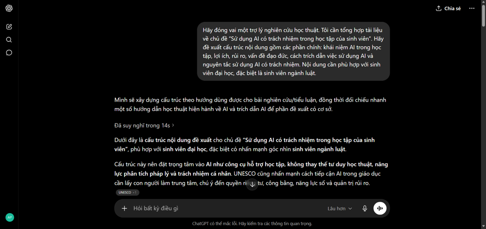
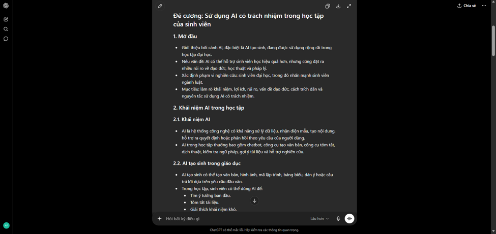
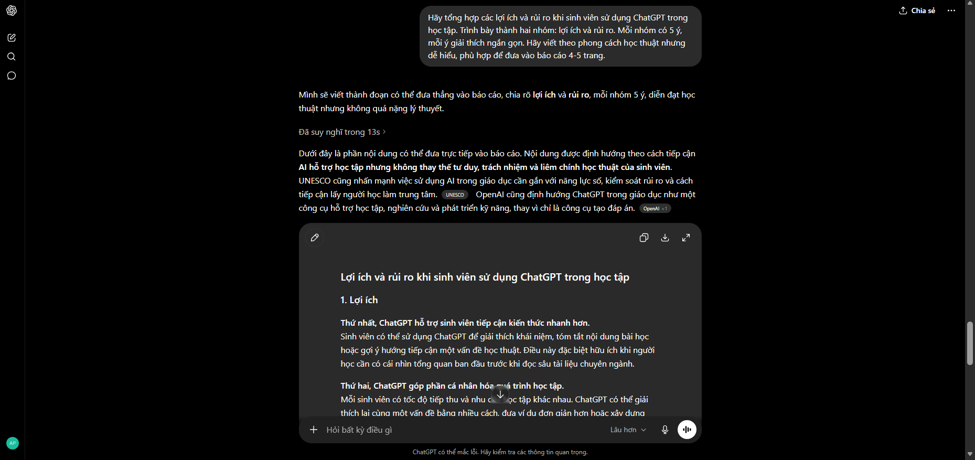
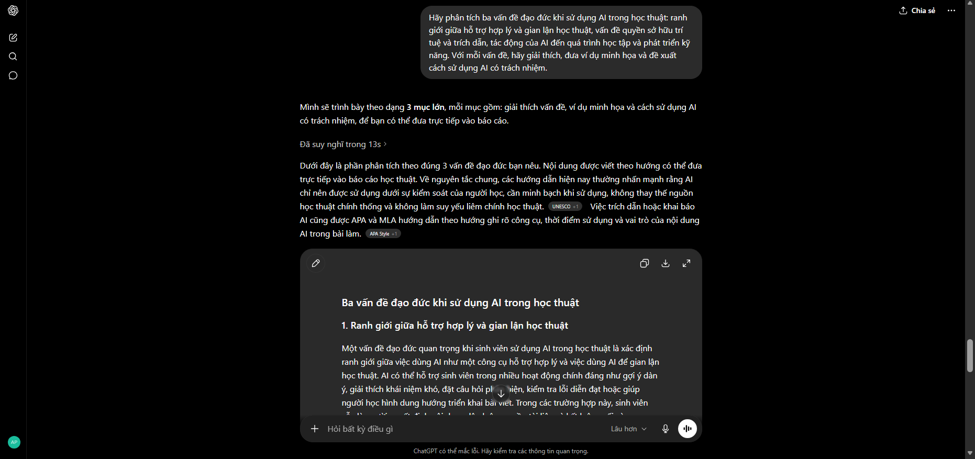
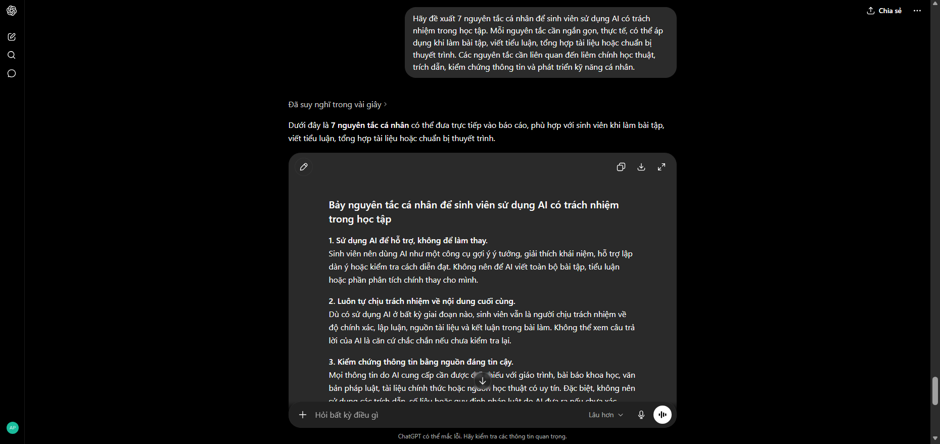
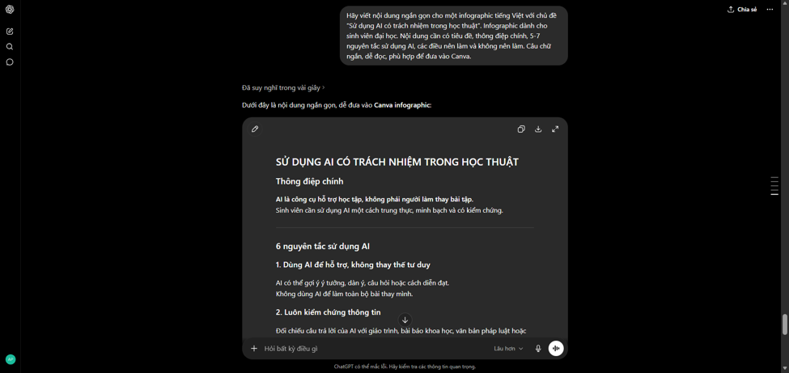
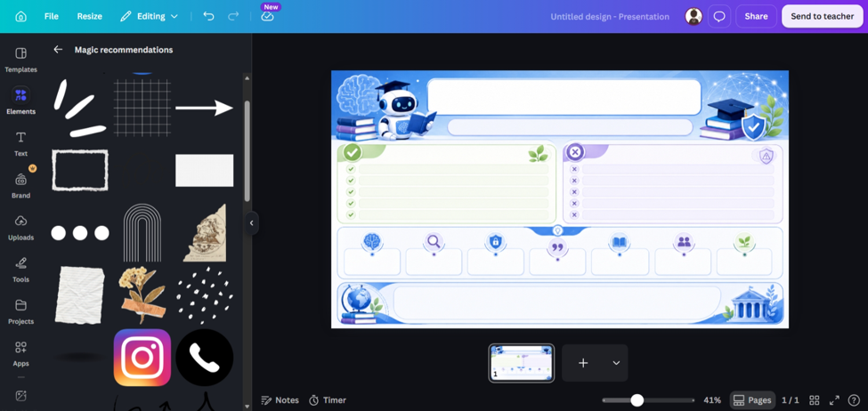
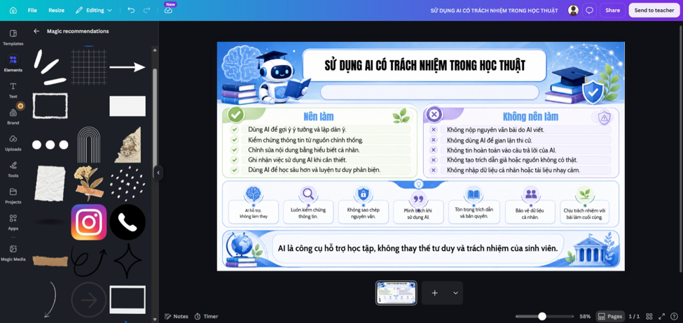

# **BÁO CÁO: SỬ DỤNG AI CÓ TRÁCH NHIỆM VÀ ĐẠO ĐỨC TRONG HỌC TẬP**

## **Thông tin sinh viên**

* **Họ và tên:** Hoàng Phương Thảo

* **Mã sinh viên:** 24061610

* **Lớp:** VNU1001\_E252034

* **Môn học:** Nhập môn công nghệ số và ứng dụng trí tuệ nhân tạo

* **Trường:** Trường Đại học Luật – Đại học Quốc gia Hà Nội

* **Chủ đề báo cáo:** Sử dụng AI có trách nhiệm trong học tập và nghiên cứu

# **I. Mở đầu**

Trong những năm gần đây, trí tuệ nhân tạo, đặc biệt là các công cụ AI tạo sinh như ChatGPT, đã được sử dụng ngày càng phổ biến trong học tập và nghiên cứu. AI có thể hỗ trợ sinh viên tìm kiếm ý tưởng, tóm tắt tài liệu, giải thích khái niệm khó, lập dàn ý bài viết, chuẩn bị thuyết trình và kiểm tra lỗi diễn đạt. Tuy nhiên, nếu sử dụng không đúng cách, AI cũng có thể dẫn đến nhiều vấn đề như gian lận học thuật, sao chép nội dung, phụ thuộc vào công cụ, suy giảm tư duy phản biện và vi phạm quyền sở hữu trí tuệ.

Trong báo cáo này, em lựa chọn nghiên cứu vấn đề **sử dụng AI có trách nhiệm trong học tập tại Trường Đại học Luật – Đại học Quốc gia Hà Nội**. Báo cáo gồm các nội dung chính: phân tích chính sách và định hướng liên quan đến AI, mô tả quá trình sử dụng ChatGPT để tổng hợp tài liệu, phân tích các vấn đề đạo đức học thuật, xây dựng bộ nguyên tắc cá nhân và đề xuất nội dung infographic minh họa.

Nhiệm vụ học tập được lựa chọn trong bài là: “Tổng hợp tài liệu về sử dụng AI có trách nhiệm trong học tập của sinh viên”

Công cụ AI được sử dụng là **ChatGPT**. AI được dùng để hỗ trợ tìm ý tưởng, hệ thống hóa nội dung, đề xuất cấu trúc và tạo bản nháp ban đầu. Tuy nhiên, em không sử dụng nguyên văn toàn bộ đầu ra của AI mà đã đọc lại, đánh giá, chỉnh sửa, bổ sung quan điểm cá nhân và sắp xếp lại nội dung để phù hợp với yêu cầu học thuật.

# **II. Nghiên cứu chính sách của trường về sử dụng AI trong học tập và nghiên cứu**

**1\. Chính sách và định hướng liên quan tại ĐHQGHN và Trường Đại học Luật**

Qua quá trình tìm hiểu các nguồn công khai, em chưa tìm thấy một văn bản riêng của Trường Đại học Luật – Đại học Quốc gia Hà Nội quy định cụ thể, độc lập về việc sinh viên được hoặc không được sử dụng AI trong bài tập, bài thi, khóa luận hay nghiên cứu khoa học. Tuy nhiên, có thể phân tích vấn đề này dựa trên các quy định và định hướng liên quan của ĐHQGHN và nhà trường.

**Thứ nhất**, ĐHQGHN đã có hướng dẫn về việc trích dẫn trong các ấn phẩm khoa học. Hướng dẫn này đề cập đến việc trích dẫn tài liệu tham khảo, đạo văn, tự đạo văn, kiểm tra đạo văn và thẩm định mức độ đạo văn. Đây là cơ sở quan trọng khi xem xét việc sử dụng AI trong học thuật. Nếu sinh viên sử dụng nội dung do AI tạo ra nhưng không kiểm chứng, không chỉnh sửa, không ghi nhận sự hỗ trợ của AI hoặc trình bày như thể hoàn toàn do bản thân tạo ra, hành vi đó có thể xung đột với tinh thần trung thực và minh bạch học thuật.

**Thứ hai**, ĐHQGHN đã có định hướng đưa nội dung công nghệ số và trí tuệ nhân tạo vào chương trình đào tạo cho sinh viên từ năm nhất. Điều này cho thấy ĐHQGHN không tiếp cận AI theo hướng cấm đoán tuyệt đối, mà coi AI là một năng lực cần được trang bị cho người học trong bối cảnh giáo dục đại học hiện đại. Tuy nhiên, việc trang bị năng lực AI cần đi kèm với ý thức sử dụng có trách nhiệm, biết kiểm chứng thông tin và tuân thủ liêm chính học thuật.

**Thứ ba**, Trường Đại học Luật – ĐHQGHN có định hướng phát triển khoa học, công nghệ và đổi mới sáng tạo. Trong chiến lược phát triển khoa học, công nghệ và đổi mới sáng tạo, nhà trường nhấn mạnh vai trò của hoạt động nghiên cứu, đổi mới sáng tạo và phát triển năng lực người học. Điều này phù hợp với việc khuyến khích sinh viên biết khai thác công cụ công nghệ mới, trong đó có AI, để phục vụ học tập và nghiên cứu. Tuy nhiên, với đặc thù của ngành luật, việc sử dụng AI càng cần thận trọng vì kiến thức pháp lý đòi hỏi độ chính xác, khả năng lập luận, trích dẫn nguồn đáng tin cậy và đánh giá bối cảnh xã hội.

**Thứ tư**, các hoạt động học thuật tại Trường Đại học Luật cũng đã đề cập đến vấn đề AI và đạo đức. Một số tọa đàm, diễn đàn của trường đã nhấn mạnh rằng AI có thể hỗ trợ phân tích dữ liệu, tra cứu thông tin hoặc gợi ý phương án, nhưng không thể thay thế hoàn toàn khả năng đánh giá chuẩn mực đạo đức, bối cảnh xã hội và trách nhiệm nghề nghiệp của con người. Đây là nhận định rất quan trọng đối với sinh viên luật, vì trong học tập pháp lý, câu trả lời không chỉ cần đúng về mặt thông tin mà còn cần có lập luận, căn cứ pháp lý và trách nhiệm đạo đức.

**Từ các điểm trên,** có thể nhận định rằng chính sách và định hướng của ĐHQGHN cũng như Trường Đại học Luật không phủ nhận vai trò của AI trong học tập. Tuy nhiên, việc sử dụng AI phải đặt trong khuôn khổ của liêm chính học thuật, trích dẫn minh bạch, kiểm chứng thông tin và trách nhiệm cá nhân của người học.

## **2\. So sánh với chính sách của một số trường khác**

Khi so sánh với một số trường đại học khác ở Việt Nam và quốc tế, có thể thấy xu hướng chung là không cấm hoàn toàn AI, mà quản lý việc sử dụng AI theo hướng minh bạch và có trách nhiệm.

**Đại học Kinh tế Thành phố Hồ Chí Minh** đã ban hành quy định về kiểm soát đạo văn và sử dụng AI trong các sản phẩm học thuật. Theo định hướng này, AI được xác định là công cụ hỗ trợ, không thay thế vai trò tư duy, phân tích và sáng tạo của tác giả.

**Trường Đại học Nha Trang** cũng có quy định liên quan đến kiểm soát đạo văn và sử dụng AI trong sản phẩm học thuật. Một điểm đáng chú ý là AI được xem là công cụ phục vụ và hỗ trợ con người, không thay thế con người trong quá trình học tập, đánh giá và tạo ra sản phẩm học thuật. Người học vẫn phải chịu trách nhiệm cuối cùng với sản phẩm của mình.

**RMIT Việt Nam** tiếp cận AI theo hướng gắn với liêm chính học thuật và hướng dẫn sinh viên sử dụng AI hiệu quả. Thay vì chỉ xem AI là nguy cơ gian lận, trường cũng chú trọng việc giúp sinh viên hiểu cách sử dụng AI một cách phù hợp, có đạo đức và có tư duy phản biện.

So với các trường trên, **Trường Đại học Luật – ĐHQGHN** hiện chưa có văn bản công khai riêng biệt về sử dụng AI trong học tập. Tuy nhiên, nhà trường có nền tảng về liêm chính học thuật, trích dẫn khoa học, định hướng đổi mới sáng tạo và các hoạt động học thuật về đạo đức AI. Vì vậy, theo quan điểm cá nhân, trong thời gian tới, nhà trường có thể xây dựng hướng dẫn cụ thể hơn về việc sinh viên sử dụng AI, ví dụ: trường hợp nào được phép dùng AI, trường hợp nào không được phép, cách khai báo việc sử dụng AI, cách trích dẫn đầu ra AI và trách nhiệm của sinh viên khi nộp sản phẩm học thuật có sự hỗ trợ của AI.

## **3\. Nhận định cá nhân**

Theo em, AI không nên bị cấm tuyệt đối trong học tập, vì đây là một công cụ có thể hỗ trợ sinh viên học hiệu quả hơn. Tuy nhiên, AI cũng không nên được sử dụng một cách tùy tiện. Đối với sinh viên luật, việc dùng AI cần đặc biệt cẩn trọng vì AI có thể tạo ra thông tin không chính xác, nhầm lẫn quy định pháp luật, trích dẫn sai văn bản hoặc đưa ra lập luận thiếu căn cứ.

Do đó, cách tiếp cận hợp lý nhất là xem AI như một **trợ lý học tập**, không phải người làm thay bài. Sinh viên có thể dùng AI để tìm ý tưởng, lập dàn ý, tóm tắt tài liệu hoặc kiểm tra diễn đạt. Tuy nhiên, sinh viên cần tự đọc tài liệu gốc, tự phân tích, tự kiểm chứng thông tin và chịu trách nhiệm với sản phẩm cuối cùng. Khi AI có tham gia vào quá trình làm bài, người học cần ghi nhận một cách minh bạch.

# **III. Thực hiện nhiệm vụ học tập với sự hỗ trợ của AI**

## **1\. Nhiệm vụ học tập được chọn**

Nhiệm vụ học tập được chọn là: “Tổng hợp tài liệu về sử dụng AI có trách nhiệm trong học tập của sinh viên”

Mục tiêu của nhiệm vụ là xây dựng một bản tổng hợp ngắn, có hệ thống về lợi ích, rủi ro, vấn đề đạo đức và nguyên tắc sử dụng AI trong học thuật. Nội dung này được sử dụng làm cơ sở cho phần phân tích đạo đức và thiết kế infographic ở cuối báo cáo.

Công cụ AI được sử dụng: **ChatGPT**.

## **2\. Prompt và đầu ra của AI**

## **Prompt 1: Yêu cầu AI đề xuất cấu trúc tổng hợp tài liệu**

**Prompt đã sử dụng:**

Hãy đóng vai một trợ lý nghiên cứu học thuật. Tôi cần tổng hợp tài liệu về chủ đề “Sử dụng AI có trách nhiệm trong học tập của sinh viên”. Hãy đề xuất cấu trúc nội dung gồm các phần chính: khái niệm AI trong học tập, lợi ích, rủi ro, vấn đề đạo đức, cách trích dẫn việc sử dụng AI và nguyên tắc sử dụng AI có trách nhiệm. Nội dung cần phù hợp với sinh viên đại học, đặc biệt là sinh viên ngành luật.

**Đầu ra AI nhận được:**

ChatGPT đề xuất cấu trúc gồm 6 phần: khái niệm AI trong học tập, lợi ích của AI, rủi ro khi sử dụng AI, các vấn đề đạo đức, cách ghi nhận việc sử dụng AI và bộ nguyên tắc sử dụng AI có trách nhiệm. AI cũng gợi ý nên nhấn mạnh các vấn đề như gian lận học thuật, đạo văn, quyền sở hữu trí tuệ, tính chính xác của thông tin và sự phụ thuộc vào công cụ.

**Đánh giá đầu ra:**

Đầu ra của AI có cấu trúc rõ ràng, phù hợp với yêu cầu đề bài. Tuy nhiên, nội dung còn ở mức khái quát, chưa gắn nhiều với bối cảnh của Trường Đại học Luật – ĐHQGHN và đặc thù ngành luật. Vì vậy, em chỉ sử dụng cấu trúc này làm khung ban đầu, sau đó bổ sung thêm phần phân tích chính sách của trường và ví dụ liên quan đến học tập pháp lý.

**Cách chỉnh sửa và tích hợp:**

Em giữ lại 5 nhóm nội dung chính: lợi ích, rủi ro, đạo đức, trích dẫn minh bạch và nguyên tắc cá nhân. Sau đó, em sắp xếp lại để phù hợp với bố cục báo cáo. Em cũng bổ sung nhận định cá nhân rằng sinh viên luật không nên dùng AI để thay thế việc đọc văn bản pháp luật, án lệ, giáo trình và tài liệu học thuật.

****

*Ảnh chụp màn hình prompt 1 và kết quả ChatGPT trả lời*

## **Prompt 2: Yêu cầu AI tổng hợp lợi ích và rủi ro**

**Prompt đã sử dụng:**

Hãy tổng hợp các lợi ích và rủi ro khi sinh viên sử dụng ChatGPT trong học tập. Trình bày thành hai nhóm: lợi ích và rủi ro. Mỗi nhóm có 5 ý, mỗi ý giải thích ngắn gọn. Hãy viết theo phong cách học thuật nhưng dễ hiểu, phù hợp để đưa vào báo cáo 4-5 trang.

**Đầu ra AI nhận được:**

ChatGPT nêu các lợi ích như: hỗ trợ tìm ý tưởng, giải thích khái niệm khó, tóm tắt tài liệu, cải thiện diễn đạt và hỗ trợ tự học. Các rủi ro gồm: thông tin sai lệch, phụ thuộc vào AI, giảm tư duy phản biện, nguy cơ đạo văn và thiếu minh bạch khi sử dụng.

**Đánh giá đầu ra:**

Phần lợi ích và rủi ro khá đầy đủ, nhưng một số ý còn chung chung. Ví dụ, AI chỉ nêu “thông tin có thể sai” nhưng chưa giải thích rõ trong ngành luật, sai thông tin có thể dẫn đến việc hiểu nhầm quy định pháp luật hoặc áp dụng sai căn cứ. Vì vậy, em đã chỉnh sửa để làm rõ hơn trong bối cảnh sinh viên luật.

**Cách chỉnh sửa và tích hợp:**

Em chỉnh nội dung theo hướng cụ thể hơn. Ví dụ:

* Ý AI đưa ra: “AI có thể cung cấp thông tin sai.”

  * Em chỉnh thành: “Trong học tập pháp luật, AI có thể nhầm lẫn văn bản pháp luật, hiệu lực văn bản hoặc nội dung điều luật. Vì vậy, sinh viên phải kiểm chứng bằng nguồn chính thống.”

Nhờ vậy, nội dung báo cáo phù hợp hơn với ngành học và thể hiện được sự đánh giá cá nhân thay vì chỉ sao chép đầu ra AI.

****

*Ảnh chụp màn hình prompt 2 và kết quả AI tổng hợp lợi ích, rủi ro*

## **Prompt 3: Yêu cầu AI phân tích vấn đề đạo đức**

**Prompt đã sử dụng:**

Hãy phân tích ba vấn đề đạo đức khi sử dụng AI trong học thuật: ranh giới giữa hỗ trợ hợp lý và gian lận học thuật, vấn đề quyền sở hữu trí tuệ và trích dẫn, tác động của AI đến quá trình học tập và phát triển kỹ năng. Với mỗi vấn đề, hãy giải thích, đưa ví dụ minh họa và đề xuất cách sử dụng AI có trách nhiệm.

**Đầu ra AI nhận được:**

ChatGPT phân tích ba vấn đề chính. Đối với ranh giới giữa hỗ trợ và gian lận, AI cho rằng việc dùng AI để gợi ý ý tưởng là hợp lý, nhưng nộp nguyên văn bài do AI viết là gian lận. Đối với quyền sở hữu trí tuệ, AI nhấn mạnh cần ghi nhận nguồn và tránh sao chép. Đối với phát triển kỹ năng, AI cho rằng phụ thuộc vào AI có thể làm giảm khả năng tự học, tự viết và tư duy phản biện.

**Đánh giá đầu ra:**

Đầu ra phù hợp với yêu cầu đề bài, có thể sử dụng làm nền cho phần phân tích đạo đức. Tuy nhiên, một số ví dụ còn đơn giản. Em đã bổ sung thêm ví dụ cụ thể, chẳng hạn như sinh viên dùng AI để viết toàn bộ bài tiểu luận luật mà không đọc văn bản pháp luật gốc, hoặc dùng AI để tạo trích dẫn giả.

**Cách chỉnh sửa và tích hợp:**

Em dùng các ý chính của AI, sau đó viết lại theo cách diễn đạt cá nhân. Em bổ sung liên hệ với việc học luật, trong đó người học cần năng lực đọc hiểu văn bản, lập luận pháp lý, xác định căn cứ và đánh giá tình huống. Những năng lực này không thể giao hoàn toàn cho AI.

****

*Ảnh chụp màn hình prompt 3 và kết quả AI phân tích vấn đề đạo đức*

## **Prompt 4: Yêu cầu AI đề xuất bộ nguyên tắc cá nhân**

**Prompt đã sử dụng:**

Hãy đề xuất 7 nguyên tắc cá nhân để sinh viên sử dụng AI có trách nhiệm trong học tập. Mỗi nguyên tắc cần ngắn gọn, thực tế, có thể áp dụng khi làm bài tập, viết tiểu luận, tổng hợp tài liệu hoặc chuẩn bị thuyết trình. Các nguyên tắc cần liên quan đến liêm chính học thuật, trích dẫn, kiểm chứng thông tin và phát triển kỹ năng cá nhân.

**Đầu ra AI nhận được:**

ChatGPT đề xuất các nguyên tắc như: không nộp nguyên văn nội dung AI, kiểm chứng thông tin, ghi nhận việc sử dụng AI, không dùng AI để gian lận, bảo vệ dữ liệu cá nhân, dùng AI để học chứ không dùng để thay thế tư duy và tuân thủ quy định của giảng viên.

**Đánh giá đầu ra:**

Các nguyên tắc khá phù hợp, nhưng cần diễn đạt lại để rõ ràng và có tính cá nhân hơn. Một số nguyên tắc còn trùng ý, vì vậy em đã gộp lại và sắp xếp thành 7 nguyên tắc hoàn chỉnh.

**Cách chỉnh sửa và tích hợp:**

Em viết lại bộ nguyên tắc bằng ngôn ngữ của bản thân, đồng thời liên kết từng nguyên tắc với các vấn đề đạo đức đã phân tích. Ví dụ, nguyên tắc “Không nộp nguyên văn sản phẩm AI” liên quan đến vấn đề gian lận học thuật; nguyên tắc “Kiểm chứng thông tin từ nguồn chính thống” liên quan đến độ chính xác; nguyên tắc “Ghi nhận việc sử dụng AI” liên quan đến minh bạch học thuật.

*Ảnh chụp màn hình prompt 4 và kết quả AI đề xuất nguyên tắc*

## **Prompt 5: Yêu cầu AI hỗ trợ nội dung infographic**

**Prompt đã sử dụng:**

Hãy viết nội dung ngắn gọn cho một infographic tiếng Việt với chủ đề “Sử dụng AI có trách nhiệm trong học thuật”. Infographic dành cho sinh viên đại học. Nội dung cần có tiêu đề, thông điệp chính, 5-7 nguyên tắc sử dụng AI, các điều nên làm và không nên làm. Câu chữ ngắn, dễ đọc, phù hợp để đưa vào Canva.

**Đầu ra AI nhận được:**

ChatGPT đề xuất tiêu đề “Sử dụng AI có trách nhiệm trong học thuật”, thông điệp chính “AI là công cụ hỗ trợ, không thay thế tư duy của người học”, cùng các nguyên tắc như kiểm chứng thông tin, không sao chép nguyên văn, ghi nhận việc sử dụng AI, bảo vệ dữ liệu cá nhân và tuân thủ quy định học thuật.

**Đánh giá đầu ra:**

Đầu ra phù hợp để thiết kế infographic, nhưng còn hơi dài. Em đã rút gọn lại thành các câu ngắn, dễ đọc và có thể đặt trong các khối nội dung nhỏ trên infographic.

****

*Ảnh chụp màn hình prompt 5 và kết quả AI đề xuất nội dung infographic*

# **IV. Bản tổng hợp tài liệu sau khi chỉnh sửa**

Sau khi sử dụng ChatGPT và chỉnh sửa lại, em hoàn thiện bản tổng hợp tài liệu như sau:

AI trong học tập là việc sử dụng các công cụ trí tuệ nhân tạo để hỗ trợ quá trình tiếp nhận, xử lý và trình bày tri thức. Đối với sinh viên, AI có thể hỗ trợ nhiều hoạt động như tìm ý tưởng, lập dàn ý, tóm tắt tài liệu, giải thích khái niệm khó, dịch thuật, luyện tập câu hỏi và cải thiện cách diễn đạt. Nếu được sử dụng hợp lý, AI có thể giúp sinh viên tiết kiệm thời gian và học tập chủ động hơn.

Tuy nhiên, AI cũng đặt ra nhiều rủi ro. Trước hết, AI có thể tạo ra thông tin sai hoặc thiếu chính xác. Đối với sinh viên luật, điều này đặc biệt nguy hiểm vì việc hiểu sai văn bản pháp luật, điều luật hoặc nguyên tắc pháp lý có thể ảnh hưởng trực tiếp đến chất lượng bài làm. Thứ hai, sinh viên có thể trở nên phụ thuộc vào AI, giảm khả năng đọc tài liệu gốc, tự lập luận và tự viết. Thứ ba, nếu sử dụng AI để tạo toàn bộ bài làm rồi nộp như sản phẩm cá nhân, sinh viên có thể vi phạm liêm chính học thuật.

Việc sử dụng AI có trách nhiệm đòi hỏi người học phải hiểu rõ ranh giới giữa hỗ trợ và gian lận. AI có thể được dùng để gợi ý hướng tiếp cận, giải thích khái niệm hoặc kiểm tra lỗi diễn đạt. Tuy nhiên, AI không nên được dùng để thay thế hoàn toàn quá trình tư duy, phân tích và viết bài của sinh viên. Người học cần kiểm chứng thông tin từ giáo trình, văn bản pháp luật, tài liệu khoa học và nguồn chính thống.

Ngoài ra, việc sử dụng AI cần minh bạch. Nếu AI có hỗ trợ đáng kể trong quá trình làm bài, sinh viên nên ghi nhận điều đó trong báo cáo hoặc phần chú thích. Ví dụ: “Báo cáo có sử dụng ChatGPT để hỗ trợ lập dàn ý và gợi ý nội dung ban đầu. Người viết đã kiểm tra, chỉnh sửa và chịu trách nhiệm về toàn bộ nội dung cuối cùng.” Cách ghi nhận này giúp thể hiện sự trung thực và trách nhiệm học thuật.

Tóm lại, AI là một công cụ hữu ích nhưng không thay thế vai trò của con người. Giá trị thật sự của việc học nằm ở quá trình sinh viên tự đọc, tự hiểu, tự phân tích và hình thành quan điểm cá nhân. AI chỉ nên đóng vai trò hỗ trợ, còn người học phải chịu trách nhiệm cuối cùng với sản phẩm học thuật của mình.

# **V. Trích dẫn việc sử dụng AI một cách minh bạch**

Trong quá trình thực hiện báo cáo này, em đã sử dụng ChatGPT để hỗ trợ các công việc sau:

* Gợi ý cấu trúc tổng hợp tài liệu.

* Đề xuất các lợi ích và rủi ro khi sử dụng AI trong học tập.

* Gợi ý các vấn đề đạo đức liên quan đến AI trong học thuật.

* Đề xuất bộ nguyên tắc cá nhân về sử dụng AI có trách nhiệm.

* Hỗ trợ viết nội dung ngắn gọn cho infographic.

Tuy nhiên, em không sử dụng nguyên văn toàn bộ nội dung do AI tạo ra. Các đầu ra của AI đã được em đọc lại, đánh giá, chỉnh sửa, bổ sung ví dụ và liên hệ với bối cảnh học tập tại Trường Đại học Luật – ĐHQGHN. Em chịu trách nhiệm với nội dung cuối cùng của báo cáo.

**Câu trích dẫn việc sử dụng AI:**

Báo cáo này có sử dụng ChatGPT để hỗ trợ lập dàn ý, gợi ý nội dung ban đầu và đề xuất cách trình bày. Người viết đã kiểm chứng, chỉnh sửa, bổ sung quan điểm cá nhân và chịu trách nhiệm đối với toàn bộ nội dung cuối cùng.

# **VI. Phân tích các vấn đề đạo đức khi sử dụng AI trong học thuật**

## **1\. Ranh giới giữa hỗ trợ hợp lý và gian lận học thuật**

Vấn đề đạo đức đầu tiên là xác định ranh giới giữa việc sử dụng AI như một công cụ hỗ trợ và việc lạm dụng AI để gian lận học thuật. Trong học tập, không phải mọi hành vi sử dụng AI đều sai. Nếu sinh viên dùng AI để tìm ý tưởng, lập dàn ý, giải thích khái niệm khó hoặc kiểm tra lỗi diễn đạt, đó có thể được xem là hỗ trợ hợp lý. Trong trường hợp này, AI đóng vai trò giống như một công cụ học tập giúp người học hiểu vấn đề nhanh hơn.

Tuy nhiên, nếu sinh viên yêu cầu AI viết toàn bộ bài luận, tiểu luận hoặc báo cáo rồi nộp như sản phẩm của mình, hành vi đó có thể bị xem là gian lận học thuật. Bản chất của học tập là người học phải tự tìm hiểu, tư duy, phân tích và trình bày quan điểm. Khi AI làm thay toàn bộ quá trình này, sinh viên không còn thể hiện năng lực thật của bản thân.

Ví dụ, trong một bài tiểu luận luật, sinh viên có thể hỏi AI: “Hãy gợi ý các vấn đề pháp lý cần phân tích trong tranh chấp hợp đồng.” Đây là cách dùng hợp lý vì sinh viên vẫn phải tự đọc luật và tự phân tích. Nhưng nếu sinh viên yêu cầu AI: “Hãy viết toàn bộ bài tiểu luận 3000 từ về tranh chấp hợp đồng để tôi nộp”, sau đó nộp nguyên văn, thì đó là hành vi không trung thực.

Vì vậy, ranh giới quan trọng nằm ở mức độ kiểm soát của người học. Nếu AI chỉ hỗ trợ một phần và sinh viên vẫn là người phân tích, chỉnh sửa, kiểm chứng và chịu trách nhiệm, việc sử dụng AI có thể chấp nhận được. Ngược lại, nếu AI thay thế toàn bộ tư duy và công sức của người học, việc sử dụng AI trở thành gian lận.

## **2\. Quyền sở hữu trí tuệ, trích dẫn và minh bạch học thuật**

Vấn đề đạo đức thứ hai là quyền sở hữu trí tuệ và trích dẫn. Khi sử dụng AI, sinh viên dễ nhầm tưởng rằng nội dung do AI tạo ra là “miễn phí” và có thể dùng tùy ý. Tuy nhiên, trong môi trường học thuật, mọi thông tin, ý tưởng và nội dung được sử dụng đều cần được xem xét về nguồn gốc, độ tin cậy và cách ghi nhận.

AI có thể tổng hợp thông tin từ nhiều nguồn khác nhau, nhưng không phải lúc nào cũng chỉ rõ nguồn. Thậm chí, AI có thể tạo ra trích dẫn không có thật hoặc thông tin nghe có vẻ hợp lý nhưng sai. Nếu sinh viên sử dụng các thông tin đó mà không kiểm tra, bài làm có thể mắc lỗi nghiêm trọng.

Đối với ngành luật, yêu cầu trích dẫn càng quan trọng. Khi phân tích một vấn đề pháp lý, sinh viên cần dựa vào văn bản pháp luật, giáo trình, án lệ, bài nghiên cứu hoặc tài liệu chính thống. AI không thể thay thế việc tra cứu nguồn gốc pháp lý. Nếu AI đưa ra một điều luật, sinh viên phải kiểm tra lại văn bản gốc để bảo đảm đúng nội dung và hiệu lực.

Minh bạch học thuật cũng là một yêu cầu cần thiết. Nếu AI hỗ trợ đáng kể trong quá trình làm bài, sinh viên nên ghi nhận việc sử dụng AI. Việc ghi nhận không làm giảm giá trị bài làm, mà thể hiện sự trung thực và ý thức trách nhiệm. Ngược lại, che giấu việc sử dụng AI trong khi AI đóng góp phần lớn vào sản phẩm có thể tạo ra sự thiếu minh bạch.

## **3\. Tác động đến quá trình học tập và phát triển kỹ năng**

Vấn đề đạo đức thứ ba là tác động của AI đến quá trình học tập và phát triển kỹ năng. AI có thể giúp sinh viên học nhanh hơn, nhưng cũng có thể làm sinh viên học thụ động hơn nếu lạm dụng. Khi quá phụ thuộc vào AI, sinh viên có thể mất dần khả năng tự đọc, tự viết, tự lập luận và tự giải quyết vấn đề.

Trong học tập ngành luật, các kỹ năng quan trọng không chỉ là ghi nhớ kiến thức mà còn là đọc hiểu văn bản, phân tích tình huống, xác định vấn đề pháp lý, lập luận logic và bảo vệ quan điểm. Những kỹ năng này chỉ hình thành thông qua quá trình tự học và luyện tập. Nếu sinh viên dùng AI để làm thay mọi bước, sinh viên có thể hoàn thành bài nhanh hơn nhưng không thật sự phát triển năng lực.

Ví dụ, khi chuẩn bị một bài thuyết trình, sinh viên có thể dùng AI để gợi ý dàn ý. Tuy nhiên, sinh viên vẫn cần tự hiểu nội dung, tự chọn ví dụ, tự luyện cách trình bày và tự trả lời câu hỏi. Nếu chỉ đọc lại nội dung AI tạo ra mà không hiểu, sinh viên sẽ gặp khó khăn khi được giảng viên hoặc bạn học đặt câu hỏi.

Do đó, AI nên được sử dụng như một công cụ hỗ trợ phát triển kỹ năng, không phải công cụ thay thế kỹ năng. Một cách sử dụng tốt là yêu cầu AI giải thích khái niệm, sau đó tự viết lại bằng ngôn ngữ của mình. Cách này giúp người học vừa tận dụng được AI vừa duy trì quá trình tư duy cá nhân.

# **VII. Bộ nguyên tắc cá nhân về sử dụng AI có trách nhiệm trong học tập**

Dựa trên các phân tích trên, em xây dựng bộ 7 nguyên tắc cá nhân khi sử dụng AI trong học tập như sau:

## **Nguyên tắc 1: Không dùng AI để làm thay toàn bộ bài tập**

Em chỉ sử dụng AI để hỗ trợ tìm ý tưởng, lập dàn ý, giải thích khái niệm hoặc kiểm tra diễn đạt. Em không nộp nguyên văn bài viết do AI tạo ra như sản phẩm cá nhân của mình.

## **Nguyên tắc 2: Luôn kiểm chứng thông tin từ nguồn đáng tin cậy**

Mọi thông tin do AI cung cấp cần được kiểm tra lại bằng giáo trình, văn bản pháp luật, tài liệu khoa học hoặc nguồn chính thống. Đặc biệt trong ngành luật, không sử dụng điều luật, án lệ hoặc khái niệm pháp lý do AI đưa ra nếu chưa kiểm chứng.

## **Nguyên tắc 3: Ghi nhận việc sử dụng AI khi AI hỗ trợ đáng kể**

Nếu AI được sử dụng trong quá trình lập dàn ý, tổng hợp nội dung hoặc chỉnh sửa bài viết, em sẽ ghi rõ trong báo cáo hoặc phần chú thích. Việc ghi nhận này thể hiện sự minh bạch và trung thực học thuật.

## **Nguyên tắc 4: Không sử dụng AI để gian lận trong kiểm tra, thi cử**

Em không sử dụng AI trong các bài kiểm tra, bài thi hoặc nhiệm vụ học tập mà giảng viên không cho phép. Khi chưa rõ có được dùng AI hay không, em sẽ hỏi giảng viên trước.

## **Nguyên tắc 5: Bảo vệ dữ liệu cá nhân và thông tin nhạy cảm**

Khi dùng AI, em không nhập thông tin cá nhân, dữ liệu riêng tư, tài liệu nội bộ hoặc nội dung chưa được phép chia sẻ. Điều này giúp tránh rủi ro về bảo mật và quyền riêng tư.

## **Nguyên tắc 6: Dùng AI để học tốt hơn, không dùng AI để né tránh việc học**

Mục tiêu sử dụng AI là giúp em hiểu bài sâu hơn, học hiệu quả hơn và phát triển kỹ năng tốt hơn. Em không dùng AI như cách để bỏ qua việc đọc tài liệu, suy nghĩ và tự luyện tập.

## **Nguyên tắc 7: Chịu trách nhiệm cuối cùng với sản phẩm học thuật**

Dù có sử dụng AI hỗ trợ, em vẫn là người chịu trách nhiệm cuối cùng về nội dung, lập luận, nguồn trích dẫn và chất lượng bài làm. Nếu bài làm có lỗi sai, em không đổ lỗi cho AI mà phải tự kiểm tra và chỉnh sửa trước khi nộp.

# **VIII. Nội dung infographic: “Sử dụng AI có trách nhiệm trong học thuật”**

## **1\. Tiêu đề infographic**

# **SỬ DỤNG AI CÓ TRÁCH NHIỆM TRONG HỌC THUẬT**

## **2\. Thông điệp chính**

AI là công cụ hỗ trợ học tập, không thay thế tư duy và trách nhiệm của sinh viên.

## **3\. Nội dung chính đưa vào infographic**

## **Nên làm**

* Dùng AI để gợi ý ý tưởng và lập dàn ý.

* Kiểm chứng thông tin từ nguồn chính thống.

* Chỉnh sửa nội dung bằng hiểu biết cá nhân.

* Ghi nhận việc sử dụng AI khi cần thiết.

* Dùng AI để học sâu hơn và luyện tư duy phản biện.

## **Không nên làm**

* Không nộp nguyên văn bài do AI viết.

* Không dùng AI để gian lận thi cử.

* Không tin hoàn toàn vào câu trả lời của AI.

* Không tạo trích dẫn giả hoặc nguồn không có thật.

* Không nhập dữ liệu cá nhân hoặc tài liệu nhạy cảm.

## **7 nguyên tắc ngắn gọn**

1. AI hỗ trợ, không làm thay.

2. Luôn kiểm chứng thông tin.

3. Không sao chép nguyên văn.

4. Minh bạch khi sử dụng AI.

5. Tôn trọng trích dẫn và bản quyền.

6. Bảo vệ dữ liệu cá nhân.

7. Chịu trách nhiệm với bài làm cuối cùng.

## **4\. Gợi ý thiết kế infographic**

Infographic nên được thiết kế theo bố cục ngang, gồm 4 phần:

* **Phần đầu:** tiêu đề lớn và thông điệp chính.

* **Phần giữa:** chia hai cột “Nên làm” và “Không nên làm”.

* **Phần tiếp theo:** 7 nguyên tắc sử dụng AI có trách nhiệm.

* **Phần cuối:** câu kết luận ngắn.

Màu sắc nên dùng: xanh dương, trắng, tím nhạt hoặc xanh lá nhạt để tạo cảm giác hiện đại, học thuật và đáng tin cậy. Nên sử dụng các biểu tượng như: não bộ, robot AI, quyển sách, dấu kiểm, kính lúp, chiếc khiên bảo mật và biểu tượng trích dẫn.

*Ảnh chụp màn hình quá trình thiết kế infographic*

**

*Ảnh chụp màn hình infographic hoàn chỉnh*

# **IX. Đánh giá vai trò của AI trong quá trình thực hiện bài**

Trong quá trình thực hiện bài báo cáo này, AI đóng vai trò là công cụ hỗ trợ học tập hữu ích. ChatGPT giúp em nhanh chóng hình thành cấu trúc nội dung, gợi ý các vấn đề cần phân tích và đề xuất cách trình bày. Nhờ đó, quá trình làm bài trở nên có hệ thống hơn và tiết kiệm thời gian hơn.

Tuy nhiên, AI không thể thay thế hoàn toàn vai trò của người học. Các câu trả lời của AI đôi khi còn chung chung, thiếu liên hệ với bối cảnh cụ thể của Trường Đại học Luật – ĐHQGHN và đặc thù ngành luật. Vì vậy, em phải tự kiểm tra, chỉnh sửa và bổ sung nội dung. Đặc biệt, đối với phần chính sách của trường, em cần tra cứu các nguồn công khai và tự đưa ra nhận định thay vì chỉ dựa vào AI.

Qua quá trình này, em nhận thấy kỹ năng quan trọng nhất khi sử dụng AI không chỉ là biết nhập prompt, mà còn là biết đánh giá đầu ra. Người học cần phân biệt đâu là gợi ý có thể sử dụng, đâu là thông tin cần kiểm chứng và đâu là nội dung cần loại bỏ. Nếu không có tư duy phản biện, người học rất dễ phụ thuộc vào AI hoặc sử dụng thông tin sai.

AI đã thay đổi cách em thực hiện nhiệm vụ học tập theo hướng nhanh hơn và có tổ chức hơn. Thay vì bắt đầu từ một trang trắng, em có thể dùng AI để tạo khung ban đầu. Tuy nhiên, phần quyết định vẫn thuộc về người học: chọn thông tin nào, sửa như thế nào, bổ sung ví dụ gì và trình bày quan điểm ra sao. Vì vậy, AI nên được xem là một trợ lý học tập, không phải người làm bài thay sinh viên.

# **X. Kết luận**

Sử dụng AI trong học tập là một xu hướng không thể tránh khỏi trong giáo dục đại học hiện nay. AI có thể hỗ trợ sinh viên học tập hiệu quả hơn, đặc biệt trong việc tìm ý tưởng, tóm tắt tài liệu, giải thích khái niệm và cải thiện cách trình bày. Tuy nhiên, AI cũng đặt ra nhiều vấn đề đạo đức như gian lận học thuật, đạo văn, thiếu minh bạch, sai lệch thông tin và suy giảm kỹ năng cá nhân.

Đối với sinh viên Trường Đại học Luật – ĐHQGHN, việc sử dụng AI cần gắn với tinh thần liêm chính học thuật, trách nhiệm cá nhân và khả năng kiểm chứng thông tin. Sinh viên luật không chỉ cần câu trả lời nhanh, mà cần lập luận chính xác, căn cứ đáng tin cậy và tư duy phản biện. AI có thể hỗ trợ quá trình này, nhưng không thể thay thế hoàn toàn vai trò của người học.

Qua bài báo cáo, em rút ra rằng sử dụng AI có trách nhiệm nghĩa là biết tận dụng lợi ích của AI nhưng không phụ thuộc vào AI; biết dùng AI để học tốt hơn nhưng không dùng AI để gian lận; biết ghi nhận sự hỗ trợ của AI và chịu trách nhiệm với sản phẩm cuối cùng. Đây là kỹ năng quan trọng mà sinh viên cần rèn luyện trong bối cảnh học tập và nghiên cứu hiện đại.

# **XI. Tài liệu tham khảo**

\[1\] Đại học Quốc gia Hà Nội, Hướng dẫn số 2383/HD-ĐHQGHN về thực hiện việc trích dẫn trong các ấn phẩm khoa học tại ĐHQGHN.

\[2\] Đại học Quốc gia Hà Nội, thông tin về học phần “Nhập môn công nghệ số và ứng dụng trí tuệ nhân tạo”.

\[3\] Trường Đại học Luật – ĐHQGHN, Chiến lược phát triển khoa học, công nghệ và đổi mới sáng tạo đến năm 2030, tầm nhìn đến năm 2045\.

\[4\] Trường Đại học Luật – ĐHQGHN, thông tin về tọa đàm/diễn đàn liên quan đến đạo đức trí tuệ nhân tạo và giới hạn của AI.

\[5\] Đại học Kinh tế Thành phố Hồ Chí Minh, quy định về kiểm soát đạo văn và sử dụng AI trong các sản phẩm học thuật.

\[6\] Trường Đại học Nha Trang, quy định về kiểm soát đạo văn và sử dụng trí tuệ nhân tạo trong sản phẩm học thuật.

\[7\] RMIT Việt Nam, nội dung về liêm chính học thuật và sử dụng AI trong học tập.
